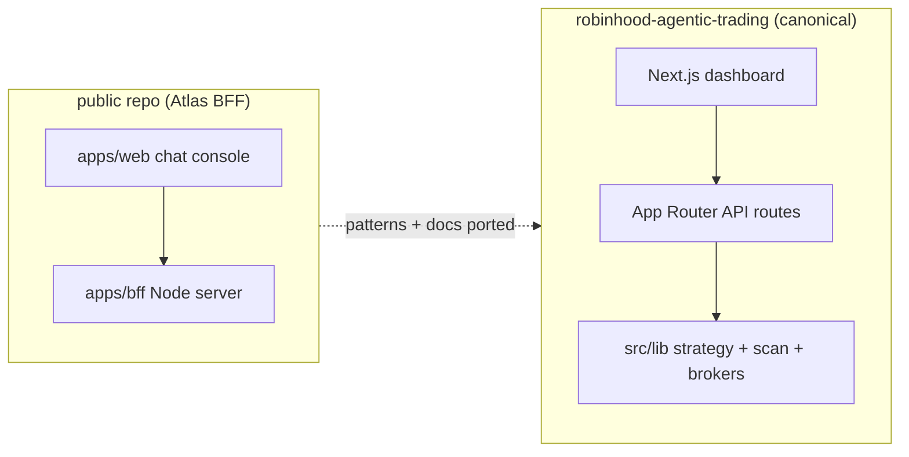

# Atlas Public Repo Integration Map

This document records how work from the public [`jaywedgeworth22/public`](https://github.com/jaywedgeworth22/public) repository ("Atlas" BFF chat assistant) relates to the private [`robinhood-agentic-trading`](https://github.com/jaywedgeworth22/robinhood-agentic-trading) dashboard.

The public repo explored a chat-first BFF MVP (`apps/bff` + `apps/web`) from the multi-expert analysis in `docs/atlas/multi-expert-app-analysis.md`. The private repo remains the canonical product: a Next.js dashboard with strategy runs, market scan, multi-broker execution, and production RAG.

## Imported into this repo (2026-06-20)

| Public feature | Private location | Notes |
|---|---|---|
| Multi-expert analysis + deep dives | `docs/atlas/` | Design reference; not runtime code |
| Milestones / deploy notes | `reference/atlas-public/` | Provenance snapshot from public `gh-pages` |
| User watchlist (persisted symbols) | `src/lib/watchlist.ts`, `app/api/watchlist/route.ts` | Distinct from strategy universe / ignore list |
| Price alerts (threshold rules + poller) | `src/lib/alerts.ts`, `app/api/alerts/route.ts`, scheduler tick | Emits `price_alert` notifications |
| Test/Paper/Brokerage honesty | Already shipped | See `docs/rollouts/2026-06-20-broker-honesty-redesign.md` |
| KB RAG: chunking + point-in-time | **Ported 2026-06-20** | `src/lib/rag/chunk.ts` + `vector-db.ts` (`storeDocument`, `retrieveContext({asOf})`, `isWithinAsOf`). NB: the prior "Already shipped (Pinecone/Voyage)" claim covered **storage only** — structure-aware chunking, point-in-time `as_of`, and citation surfacing were NOT shipped; chunking + `as_of` now are. Hybrid/RRF rerank still deferred. |
| Multi-channel alert delivery | **Ported 2026-06-20** | `src/lib/notify.ts` (push/webhook/email/SMS) + `notification_prefs` table + `app/api/notifications/*`; fired on alert triggers |
| Conversation history (redact-on-write) | **Ported 2026-06-20** | `src/lib/chat-history.ts` + `chat_turns` table + `app/api/chat-history` |
| Chat orchestrator + draft cards | **Ported 2026-06-20** | `src/lib/chat/*` (tool-loop, MockLLM + Anthropic, draft-only — never executes) + `app/api/chat` |
| Salience-gated memory store | **Ported 2026-06-20** | `src/lib/memory/*` + `user_memory` table + `app/api/memory` |
| No-execute prompt-eval gate | **Ported 2026-06-20** | `test/atlas-golden-eval.test.ts` (10 adversarial no-execute/refusal/citation cases) |
| Order blotter UI | **Partial overlap (deferred)** | Private has proposals/orders/fills; no separate blotter panel. The chat assistant's draft cards now provide a draft surface. |
| Auto-deploy launchd scripts | **Retired 2026-06-20** | The Atlas self-hosted deployment was torn down; private uses PM2 + Litestream + Infisical. Public repo emptied. |

## Architecture relationship

## Next ports (recommended order)

1. **Chat assistant panel** wired to existing strategy/quote tools (reuse Atlas orchestrator patterns, not a second BFF).
2. **Conversation history** for an optional chat tab (SQLite table, redaction on write).
3. **Watchlist UI** in the dashboard (API is ready; connect to alert creation).
4. **Salience memory** for user constraints separate from policy JSON.

## Source of truth

- Runtime: this private repo only.
- Public repo: archived reference; do not deploy both apps against the same broker credentials without coordination.
