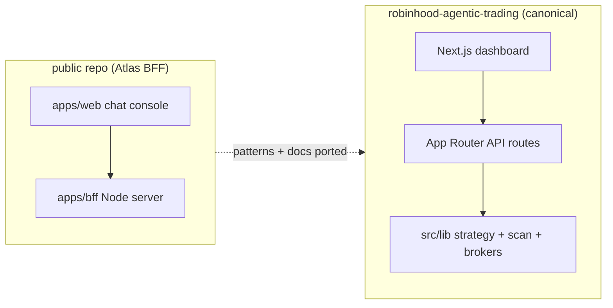

# Atlas Public Repo Integration Map

This document records how work from the public [`jaywedgeworth22/public`](https://github.com/jaywedgeworth22/public) repository ("Atlas" BFF chat assistant) relates to the private [`robinhood-agentic-trading`](https://github.com/jaywedgeworth22/robinhood-agentic-trading) dashboard.

The public repo explored a chat-first BFF MVP (`apps/bff` + `apps/web`) from the multi-expert analysis in `docs/atlas/multi-expert-app-analysis.md`. The private repo remains the canonical product: a Next.js dashboard with strategy runs, market scan, multi-broker execution, and production RAG.

## Imported into this repo (2026-06-20)

| Public feature | Private location | Notes |
|---|---|---|
| Multi-expert analysis + deep dives | `docs/atlas/` | Design reference; not runtime code |
| Milestones / deploy notes | `reference/atlas-public/` | Provenance snapshot from public `gh-pages` |
| User watchlist (persisted symbols) | `src/lib/watchlist.ts`, `app/api/watchlist/route.ts` | Distinct from strategy universe / ignore list |
| Price alerts (threshold rules + poller) | `src/lib/alerts.ts`, `app/api/alerts/route.ts`, scheduler tick | Emits `price_alert` notifications |
| Test/Paper/Brokerage honesty | Already shipped | See `docs/rollouts/2026-06-20-broker-honesty-redesign.md` |
| KB RAG with citations | Already shipped (Pinecone/Voyage) | Public in-memory RAG was the MVP; private index is production |
| Conversation history | **Deferred** | Public chat transcript store; private uses strategy audit + SSE, not a chat UI yet |
| Chat orchestrator + draft cards | **Deferred** | Valuable patterns in `reference/atlas-public/` BFF; no chat surface in dashboard yet |
| Salience-gated memory store | **Deferred** | See `docs/atlas/deep-dives/12-memory-format-and-model-decisions.md` |
| Order blotter UI | **Partial overlap** | Private has proposals/orders/fills; no separate blotter panel |
| Auto-deploy launchd scripts | **Deferred** | Private uses PM2 + `~/apps/trading-publish.sh` for production |

## Architecture relationship

## Next ports (recommended order)

1. **Chat assistant panel** wired to existing strategy/quote tools (reuse Atlas orchestrator patterns, not a second BFF).
2. **Conversation history** for an optional chat tab (SQLite table, redaction on write).
3. **Watchlist UI** in the dashboard (API is ready; connect to alert creation).
4. **Salience memory** for user constraints separate from policy JSON.

## Source of truth

- Runtime: this private repo only.
- Public repo: archived reference; do not deploy both apps against the same broker credentials without coordination.
