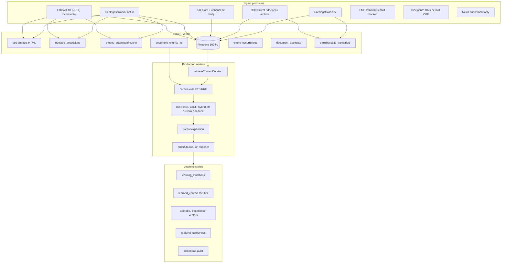

# RAG, Learning, and Recall Audit

| Field | Value |
| --- | --- |
| Date | 2026-08-17 |
| Status | Report + P0 follow-ups (parsed-text SEC writer, chat asOf, production-eval path) |
| Author | Cursor (RAG architect / IR / data-quality / ML-eval / continual-learning safety) |
| Branch | `cursor/rag-learning-recall-audit-f94a` |
| Tree | `main` at audit start (`4980322b` and ancestors) |
| Scope | Ingest, SEC/ROIC/transcripts/news, chunk/embed, dedupe, metadata, index, candidate quality, recall/precision, grounding, staleness, lineage, learning ledger, feedback, model memory, evals, failure recovery |

This is a read-only audit of the implemented stack, not a redesign.  Every finding cites a file and line from this tree.  Production Infisical knobs (for example `VECTOR_ASOF_STRICT=on` as of 2026-08-16) can differ from code defaults; both are called out.

---

## 1. Verdict

The retrieval stack is unusually mature for a single-operator trading app: demand-first ingest, two-phase vector commits, paid-embed staging, corpus-wide FTS with a strong PIT contract, extractive (not generative) highlights, consumption-filtered attribution, and a lookahead audit.  The learning stack is mostly advisory and fact-tier gated.

The highest-risk gaps are not "missing Pinecone."  They are **path divergence** and **unwired safety math**:

1. The SEC ingest worker can embed **raw HTML** while the incremental EDGAR path embeds parsed text.
2. Transcripts have **no lexical backstop** (corpus-wide FTS is `sec-edgar` + `sec-8k` only).
3. Production Green/Red/chat call `retrieveContextDetailed`.  The golden harness scores `retrieveFusedContext`.  Those are different pipelines.
4. Memory decay and vector-doc lifecycle exist as modules and are **not wired** into retrieval.
5. Chat and some desk paths omit `asOf`, so even a production `VECTOR_ASOF_STRICT=on` is a no-op on those callers.
6. Learning vector writes fail open (audit + warn) with **no retry queue**.

None of these require a new vendor.  They require one writer, one retriever, honest gold labels, and wiring already-written safety code.

---

## 2. Architecture (as implemented)



**Production callers.**  Strategy (`src/lib/strategy.ts` ~1352–1433) and chat (`src/lib/chat/orchestrator.ts` ~566–580) use `retrieveContextDetailed` only.  `retrieveFusedContext` in `src/lib/rag/search-fusion.ts` is the eval-harness / experimental stack (query deconstruct, intent router, usefulness boost, optional BGE MMR).  Do not treat harness scores as production recall.

**Strategy retrieval shape.**  Deep names (top-3 scan ∪ held) retrieve 8 chunks.  Scout names retrieve 1.  Query is `deterministicFilingsRetrievalQuery` ("Significant financial events, SEC filings, and macro catalysts for $SYM").  `asOf` is `runAsOf = new Date().toISOString()` (strategy.ts:453, :1423).  Multi-query / HyDE are flag-gated and default OFF.

**Chat retrieval shape.**  `searchKnowledge` forwards `as_of` only when the tool args include it (orchestrator.ts:571–572).  Default chat has **no PIT guard**.

---

## 3. Findings

Severity: **Critical** = wrong corpus or silent lookahead on a money path.  **High** = material recall/precision/safety gap.  **Medium** = quality, lineage, or ops hole.  **Low** = docs/comment drift.  **Info** = strength or accepted design.

### 3.1 Data ingestion and preparation

| ID | Sev | Finding | Evidence | Impact | Fix |
| --- | --- | --- | --- | --- | --- |
| I1 | **Critical** | SecIngestWorker chunks **raw HTML**, not parsed section text.  Incremental `ingestFiling` uses parsed text. | `sec-ingest-worker.ts:296–311` (`text: rawContent`) and `:374–388` (same at embed).  Contrast `sec-filings.ts` `ingestFiling` parsed-text path (~570–605). | Worker-backfilled 10-K/Q vectors and FTS contain tags, XBRL noise, and scripts.  Same accession can disagree with the incremental path.  Precision and lexical recall both degrade. | One `buildSecDocument()` helper.  Set `doc.text` to joined `parseFilingHtml` section text in both `facts_extracted` and `embed_queued`.  Do not enable `SEC_INGEST_WORKER_ENABLED` at scale until this lands. |
| I2 | **High** | `getCikForTicker` scans the CIK→ticker map and returns sentinel `0000000000` on miss. | `sec-filings.ts:77–90`.  Dual-class resolution needs `loadTickerCikMap` (`sec8k.ts:376–390`). | Wrong artifact paths / failed EDGAR fetches for GOOG-style pairs.  Silent writes under a fake CIK poison lineage. | Use ticker→CIK map.  Fail the ingest (no ledger write) when CIK is unknown. |
| I3 | **Medium** | `ingested_accessions` is not parser-revision keyed.  Comment in incremental path: no re-embed on parser upgrade. | `sec-filings.ts:509–517`.  New writes stamp `parserRevision: sec-edgar-filing-v2`. | Heterogeneous chunk quality scored as "present."  Completeness lies. | Optional `parser_revision` column + admin re-ingest job when WU budget allows. |
| I4 | **Medium** | Completeness universe is "already touched" tickers, not the 1k manifest. | `data-completeness.ts:102–150` unions `symbol_field_latest`, `ingested_accessions`, `sec_filings`.  `RAG_SCORE_DOC_TYPES` is only `10-k/10-q/8-k/earnings-transcript` (`:27`). | Fill rates look healthier than true universe coverage.  Summaries / 8-K-body / fundamentals cards are invisible. | Merge `data/rag-universe-manifest.json` as the denominator.  Split 8-K summary vs body.  Split transcript source. |
| I5 | **Info** | Budget preflight before EDGAR fetch is correct. | `sec-filings.ts:531–547`. | Avoids multi-MB fetch when embed cannot complete.  Accession stays retryable. | Keep.  Mirror on every producer. |
| I6 | **Info** | Worker default OFF; jobs only via admin seed. | `sec-ingest-worker.ts:594–601`. | Limits I1 blast radius today.  Two SEC body paths still exist. | Share one document builder before any enablement. |

### 3.2 SEC / ROIC / transcripts / news sources

| ID | Sev | Finding | Evidence | Impact | Fix |
| --- | --- | --- | --- | --- | --- |
| S1 | **High** | Corpus-wide lexical search excludes every transcript (and summary) source. | `corpus-wide-lexical.ts:320–322` `o.source IN ('sec-edgar', 'sec-8k')`.  Design: `docs/designs/2026-08-16-proposer-corpus-storage.md:78`. | If dense retrieval misses a call, there is no BM25/FTS rescue.  Approved split-writer risk is live. | After local FTS + hydrate (corpus-storage PR A/B), join `roic-*` / `earningscalls-*` with rights metadata.  Until then, treat transcript recall as dense-only in evals. |
| S2 | **High** | FMP transcript producer is hard-blocked at HTTP, but the scheduler still calls it. | `fmp-transcripts.ts:1100–1113` always `{ ok: false, kind: "access_denied", status: 403 }`. | Zero new FMP transcripts.  Capability/coverage can look like a rights problem rather than a product retirement. | Short-circuit `refreshFmpTranscripts` with `disabledReason: product_retired`. |
| S3 | **Medium** | ROIC local-cache re-ingest drops speaker turns. | `roic-transcripts.ts:552–566` `turns: []`.  `speakerSections` then collapses to one "Full call" (`:526–529`). | Cache hits lose management vs analyst section metadata used for chunking and highlights. | Persist turns in `earningscalls_transcripts.sourceMeta` or re-parse on cache hit. |
| S4 | **Medium** | ROIC v2 "latest" fallback can bind the wrong fiscal period. | `roic-transcripts.ts:510–514` accepts latest when JSON lacks `year`/`quarter`. | A row labeled `2024Q2` may be the newest call.  PIT metadata lies. | Require an explicit period match.  Never ledger an ambiguous bind. |
| S5 | **Medium** | 8-K discovery is feed-bounded (count=100) and one-ticker-per-CIK. | `sec8k.ts:614–632`, `parseCikTickerMap` `:269–278`.  Unmapped CIK dropped. | Dual-class and feed-roll misses.  Material 8-Ks never enter the backlog. | Resolve via `loadTickerCikMap`.  Per-symbol submissions poll for high-interest names. |
| S6 | **Medium** | News is enrichment-only.  No `storeDocument` / `storeContexts` for headlines. | Grep of `src/lib/**/*news*` for those writers is empty.  Catalog puts headlines under `sentiment_news`, not `rag_corpus`. | Agent cannot retrieve historical news text.  Only live scan bullets (plus optional disclosure embed). | Document as design, or add a bounded headline lane with `headline-first-seen` PIT stamps.  Do not LLM-summarize ingest. |
| S7 | **Medium** | Disclosure RAG (`RAG_EMBED_DISCLOSURES`) defaults OFF. | `disclosure-rag.ts:24–26`; web-source index fire-and-forget only when truthy. | Congress / Form 4 narratives stay structured cards, not semantic retrieval. | Enable in staging with dedup on.  Surface the flag on the data-catalog page. |
| S8 | **Info** | FilingAPI.dev is retired with defense-in-depth (no live HTTP). | `data-providers.ts` skip-register; rate-limit + catalog + capability matrix mark retired. | Residual catalog rows are intentional references. | None required. |
| S9 | **Info** | ROIC three-pass latest → deepen → archive matches proposer-corpus rev 3.  Fetch continues when the Pinecone fuse is spent. | `roic-transcripts.ts:687–694`, `:165–176`. | Individual-plan history survives locally. | Expose phase/cursor on admin status. |
| S10 | **Info** | EarningsCalls preview guard prevents 250-char preview poison. | `earningscalls-transcripts.ts:25–45`; `earningscalls-gate.ts:57–66`. | Previews never marked ingested forever. | Keep. |

### 3.3 Chunking, embedding, dedupe, metadata, indexing

| ID | Sev | Finding | Evidence | Impact | Fix |
| --- | --- | --- | --- | --- | --- |
| C1 | **High** | No speaker field on `DocumentChunk`.  Earnings splits are prepared/Q&A only. | `chunk.ts:58–75` metadata.  `document-summarizer.ts:224–236` `splitEarningsTranscript`.  ROIC *can* emit per-turn sections (`roic-transcripts.ts:526–534`) but cache path loses them (S3). | Cannot filter or cite CEO vs analyst.  Q&A collapses. | Persist speaker/role on chunk + Pinecone + FTS.  Chunk on speaker boundaries. |
| C2 | **Medium** | Query–document train/serve skew.  Stored text includes `context_header` / `[Published: …]`; query embed is the raw query.  `VECTOR_EMBED_CLEAN_TEXT` default OFF. | `vector-db.ts:994–1014`.  R17 comment at `:994–998`. | Cosine compares different representations.  Enabling clean-text requires a full re-embed (`currentEmbedRev` bump). | Either embed queries with the same header template, or flip clean-text + re-embed in one window. |
| C3 | **Medium** | Near-dedupe is post-rank only.  12% overlap chunks still embed. | `chunk.ts:9–10` (480 tokens, 12% overlap).  Worker uses 400 / 0.15 (`sec-ingest-worker.ts:313`).  `dedupeSimilar` Jaccard 0.6 in `rankPool` (`vector-db.ts:517–519`, `:7644–7658`).  Exact dedupe: `document_chunks` PK `content_hash` (`hashContent` 32 hex, `chunk.ts:33–34`). | WU/storage waste.  Prompt slots (k=3 strategy) are protected; the index is not. | Keep retrieval dedupe.  Consider ingest-time similar-dedupe for identical parent windows.  Align worker overlap with `DEFAULT_*`. |
| C4 | **Low** | `DocumentChunk` comment still says "first 16 chars."  Implementation is 32. | `chunk.ts:64–65` vs `:34`. | Docs only. | Fix the comment. |
| C5 | **Info** | Extractive highlights only.  No ingest-path LLM. | `document-summarizer.ts:12–13`, `:29` `extractive-highlights-v2`.  `proposer-format.ts:7–15` prefers summaries. | Catalysts surface without generative ingest hallucination. | Include `document-summary` in the production gold set. |
| C6 | **Info** | `embed_stage` prevents double-billing after Pinecone failure. | `db-embed-stage.ts:1–16`, key `(content_hash, model, revision)`. | Retries reuse paid vectors. | Alert on `embed_stage_cap_prune`. |
| C7 | **Info** | Embedding space isolation is enforced.  Active model is `baai/bge-m3` (OpenRouter / SiliconFlow), 1024-d. | `vector-db.ts:201–206`, `:306`, `embedSpaceFilterForModel` `:214–221`.  Recovery: `corpus-reembed.ts`. | Provider flip without re-embed → sparse retrieval, not silent mix. | Treat embed-provider change as a migration (dry-run → progress → purge). |

### 3.4 Retrieval candidate quality, recall, precision

| ID | Sev | Finding | Evidence | Impact | Fix |
| --- | --- | --- | --- | --- | --- |
| R1 | **High** | Two retrieval stacks.  Production ≠ golden harness. | Strategy/chat → `retrieveContextDetailed`.  `scripts/eval/rag-eval-harness.ts:55` → `retrieveFusedContext`. | `npm run eval:rag` / `sec_eval_golden_set` can pass while Green/Red regress. | Merge-gate on `scripts/eval/rag-production-eval.ts` (`retrieveContextDetailedWithStatus`, `strictAsOf: true`).  Deprecate or re-point the harness. |
| R2 | **Medium** | Pool-local BM25 (`HYBRID_RETRIEVAL`) default OFF.  IDF from ≤50 candidates. | `hybrid.ts:13–15`.  `vector-db.ts:878–881`. | Enabling it without measuring will not match a corpus-wide inverted index. | Keep off until ablation vs corpus-wide lexical.  Prefer FTS as the lexical leg (already default ON). |
| R3 | **Medium** | Scout k=1 + a single generic query is a recall cliff. | `strategy.ts:1380–1422` (`limit = isDeep ? 8 : 1`). | Scout names get one chunk after floors/dedupe.  A wrong 10-K risk-factor paragraph occupies the only slot. | Doc-type stratify (summary + 8-K + 10-Q) even at k=1…3.  Measure Recall@1 on scout separately. |
| R4 | **Low** | Parent expansion default ON (6k/parent, 12k total). | `vector-db.ts:534–536`.  `parent-context.ts:48–49`, `:149–150`. | Better context; can eat the 24k filings budget. | Correlate `derivePromptRagConsumption` truncated vs consumed. |
| R5 | **Info** | Adaptive rerank depths; missing credential preserves cosine order. | `rerank-policy.ts:45–49`, `:71–74`, `:106–107`. | Graceful degrade. | Telemetry on sustained `route: unavailable`. |
| R6 | **Info** | Corpus-wide lexical default ON with `strictUndated` default true. | `vector-db.ts:885–886`.  `corpus-wide-lexical.ts:29–32`, `:139`. | Strong anti-lookahead lexical leg — for filings only (S1). | Add accession / Item-code gold cases. |

Offline CI floors (fixture, not live corpus): Recall@3 ≥ 0.90, MRR ≥ 0.85 on filings-only cases (`test/rag-retrieval-eval.test.ts:183–184`).  Fixture size gated 20–40 (`:201–203`).  That is a **pipeline regression floor on recorded pools**, not production recall.

### 3.5 Grounding and citations

| ID | Sev | Finding | Evidence | Impact | Fix |
| --- | --- | --- | --- | --- | --- |
| G1 | **Medium** | Faithfulness eval is a deterministic floor, not NLI.  LLM judge default OFF. | `scripts/eval/faithfulness.ts:7–25`, `:68–79`.  `test/rag-faithfulness-eval.test.ts` never hits a live judge. | Paraphrased hallucinations can pass.  Fabricated citations and invented numbers are caught. | Keep the floor in CI.  Weekly optional judge on sampled production answers. |
| G2 | **Medium** | Chat golden eval uses `MockLLM`. | `test/atlas-golden-eval.test.ts:97`.  `docs/chat-assistant-rag-learning.md` I2. | Refusal / disclaimer / injection defenses are mock-shaped. | Nightly one-provider live eval.  Keep MockLLM for CI speed. |
| G3 | **Low** | Attribution is consumption-filtered (good).  Usefulness still joins `decision.ragAttributions`. | `strategy.ts:2233–2239`.  `retrieval-usefulness.ts:91–100`. | If the two lists drift, usefulness rewards unread chunks (±10% nudge). | Persist `consumedAttributions` on the decision row; join only those. |
| G4 | **Info** | Provenance header is real (`doc_type`, section, ticker, date, rel). | `formatChunkWithProvenance` `vector-db.ts:5933–5946`. | Citations degrade gracefully on legacy metadata. | Add accession + `content_hash` to the header so gold refs match production eval. |

### 3.6 Stale data and point-in-time honesty

| ID | Sev | Finding | Evidence | Impact | Fix |
| --- | --- | --- | --- | --- | --- |
| T1 | **High** | Code default `VECTOR_ASOF_STRICT` is OFF.  Undated chunks pass when `asOf` is set.  Server filter is fail-open for missing `as_of_epoch_ms`. | `vector-db.ts:894–902`, `:912–952`.  `isWithinAsOf`: undated kept unless strict. | Backtests and any dated caller without `strictAsOf: true` can leak undated / un-epoch'd vectors. | Prod Infisical flipped ON 2026-08-16 (`docs/rollouts/2026-08-16-asof-strict-on.md`).  **This only matters when the caller passes `asOf`.** |
| T2 | **High** | Chat `searchKnowledge` omits `asOf` unless the model supplies `as_of`.  Strict mode is then a documented no-op. | `orchestrator.ts:571–572`.  `vector-db.ts:898–899`. | Chat can retrieve post-cutoff filings for a historical question. | Default chat as-of to "now" (or the question's date).  Require `as_of` for replay questions. |
| T3 | **High** | Live desk still omits `asOf` (STATUS 2026-08-16).  Strategy *does* pass `runAsOf = now`. | `strategy.ts:453`, `:1423`.  STATUS.md VECTOR_ASOF_STRICT note. | Desk RAG dump is undated.  Strategy live path is "as of now" (drops future-dated only; undated drop depends on strict). | Pass `asOf: now` on every desk/chat retrieve.  Keep `strictAsOf: true` on every eval/backtest. |
| T4 | **Medium** | Post-mortem / lesson vectors stamp `timestamp: new Date().toISOString()` at write time. | `post-mortem.ts:576–597`.  `socratic-memory.ts:175`. | Replay with a past `asOf` can still see lessons written later that day if stamps are "now." | Stamp earliest contributing fill/decision `createdAt`. |
| T5 | **Medium** | Candidate-pool persistence (needed for lookahead RAG replay) defaults OFF. | `candidate-pool.ts:29–31`.  `lookahead-audit.ts:10–12`. | Most decisions classify RAG as `unverifiable`. | Enable `RAG_PERSIST_CANDIDATE_POOL` for the operator account.  Keep v2 debug-only. |

### 3.7 Data lineage

Strengths: `vector_ingest_commits` two-phase ledger; FTS only after `storeDocument` reports complete (`sec-ingest-worker.ts:315–317`); `ingested_accessions`; `document_abstracts`; EarningsCalls entitlement + min-char guard; ROIC local persist before Pinecone.

Gaps: I1 (HTML vs text), I2 (sentinel CIK), I3 (no parser revision), S4 (wrong fiscal bind), S1 (transcripts unjoinable to FTS).  Completeness (I4) cannot be used as a lineage proof.

### 3.8 Learning ledger, processes, feedback, model memory

| ID | Sev | Finding | Evidence | Impact | Fix |
| --- | --- | --- | --- | --- | --- |
| L1 | **High** | `blendedScore` / memory decay is tests-only.  No production import from `vector-db.ts` or `experience-memory.ts`. | `memory-decay.ts:57–68`.  Grep of `src/**` shows definitions only. | Stale lessons keep full semantic weight.  Self-reinforcement without decay. | Wire behind `RAG_MEMORY_DECAY` default-off.  Blend in `retrieveContextDetailed` rank. |
| L2 | **High** | `recordVectorDocSeen` / `archiveVectorDocs` have no production callers.  `bumpVectorDocRetrieved` updates rows that were never inserted. | `db-memory-lifecycle.ts:37–54`, `:94–106`.  Caller: `experience-memory.ts:661–664` bump only. | Lifecycle table stays empty.  L1 cannot work. | Record on `storeContexts` success.  Scheduled soft-archive.  Filter archived ids at retrieve. |
| L3 | **Medium** | Shared learned facts (`scope='shared'`) can enter another user's prompt when `learningScope === "portfolio"`. | `learned-context/store.ts:186–193`.  `db-learning.ts:965–996`. | Cross-user advisory poison with only inline `origin=` / `conf=`. | Default `includeShared` off for autonomous runs.  Require `transferState: validated`. |
| L4 | **Medium** | AI-LEARNED strategy-directive blocks are free text inside `<owner_strategy_prompt>`.  Injection is quarantined; generation always proceeds. | `learned-context/store.ts:364–386`.  `prompt-safety.ts:22`, `:105–114`. | Uncited behavioral steering from past approvals. | Structured directive schema.  Re-scan every run with a receipt. |
| L5 | **Medium** | Learning-mutation revert is not transactional with `setPolicy`. | `learning-ledger.ts:56–58`, `:129–134`. | Concurrent policy write → revert restores the wrong baseline (money path via revert API). | Capture + write in one transaction.  Version-stamp the policy. |
| L6 | **Medium** | Daily learning review advances the UTC marker on LLM / parse failure. | `learning-review.ts:876–889`. | Transient outage skips review for the rest of the day. | Advance marker only on success or empty pack.  In-day backoff. |
| L7 | **Medium** | Socratic / coach / experience vector writes degrade to audit + `console.warn`.  No retry queue. | `db-socratic.ts:434–441`.  `socratic-memory.ts:191–192`.  `experience-memory.ts:317–324`. | SQLite truth without vectors.  Usefulness join credits the wrong attributions. | Durable `vector_write_retry` (same shape as SEC ingest dead letters). |
| L8 | **Info** | Risk-tier approved rows are stored and **not** retrieved into `learnedContext` (fact-tier only). | `learned-context/store.ts:407–435`.  `db-learning.ts:969–976`. | Operators may think approval changed the prompt when it did not. | Document in UI, or add an explicit soft-risk channel. |
| L9 | **Info** | Usefulness boost is bounded (win-ratio up to 1.3× in fusion; ±10% rank nudge; min 5 samples). | `search-fusion.ts:243–279`.  `retrieval-usefulness.ts:41–63`. | Advisory only.  Fusion-path boost does not hit production `retrieveContextDetailed` (R1). | A/B with weighting off on eval runs. |
| L10 | **Info** | Numeric policy mutation is gated (closed lots, OOS, human approval for risk).  Ledger is revert-only, not prompt input. | `learning-ledger.ts`; `strategy-tuning.ts`. | Correct separation of weights vs prose. | Keep.  Fix L5 before relying on revert. |

### 3.9 Evals (what exists vs what gates)

| Harness | Path | In `npm test`? | Strict as-of? | Notes |
| --- | --- | --- | --- | --- |
| `test/rag-retrieval-eval.test.ts` | Recorded pool → rank/rerank/hybrid | Yes | Cases in fixture | Recall@3 ≥ 0.90 / MRR ≥ 0.85 on filings subset |
| `test/rag-faithfulness-eval.test.ts` | Deterministic citation + numeric | Yes | N/A | Floor only (G1) |
| `test/rag-eval-harness.test.ts` | `retrieveFusedContext` + FTS mock | Yes | Harness-specific | **Not the production retriever** (R1) |
| `test/rag-production-eval.test.ts` | Adapter / CLI contract | Partial | Requires `strictAsOf: true` | Live corpus not in default CI |
| `scripts/eval/rag-production-eval.ts` | `retrieveContextDetailedWithStatus` | No | Yes | Correct merge-gate candidate |
| `scripts/eval/rag-shadow-benchmarks.ts` | Live probe | No | — | Read-only; gated |
| `test/atlas-golden-eval.test.ts` | Chat + MockLLM | Yes | — | Mock, not provider (G2) |
| `scripts/eval/corpus-coverage.ts` | Symbol/doc_type census | No | — | Ops, not a merge gate |
| Lookahead audit | Factor + RAG replay | Scheduler | Uses `strictAsOf: true` | Needs persisted pools (T5) |

### 3.10 Failure recovery

| Path | Behavior | Gap |
| --- | --- | --- |
| Pinecone monthly WU 429 | Breaker parks writes until next month (`pinecone-wu-breaker.ts`) | Retrieval continues; ingest stalls.  Trial window paces daily fuse (`pinecone-trial-window.ts`).  Do not raise the daily fuse in this audit. |
| SEC ingest | Checkpoints, defer on 403/WU, dead-letter after max attempts, `requeueSecIngestDeadLetters` | Strong.  Worker HTML bug (I1) is independent. |
| 8-K discovery | Atomic queue commit (`persistEightKDiscovery`) | Strong. |
| FTS mirror | 20 chunks / 6s tick, durable resume, heartbeat | Strong (`fts-mirror-bound.ts`). |
| Paid embed | `embed_stage` replay | Strong. |
| Learning vectors | Audit `socratic_vector_write_degraded` | No retry (L7). |
| Learning review | Fail-safe skip + marker advance | Skips the rest of the UTC day (L6). |
| Operation lease loss | Abort vector work | Correct; do not page as a vendor outage. |
| FMP / FilingAPI | Hard-block / retired | Scheduler still ticks FMP (S2). |

---

## 4. Quantitative evaluation recommendations

Layer the gates.  Do not let a mock-pool score stand in for production recall.

### 4.1 Metrics

| Layer | Metric | Tool | Why |
| --- | --- | --- | --- |
| Retrieval (prod path) | Recall@1, @3, @10; MRR; nDCG@10 | `scripts/eval/rag-production-eval.ts` | Matches Green/Red/chat |
| Retrieval (CI fixture) | Recall@3, MRR, rerank lift, hybrid Δ | `test/rag-retrieval-eval.test.ts` | Fast regression |
| Lexical ablation | Lexical-only hit rate; `overlapCandidates` | `recall-fusion.ts` | Proves FTS is doing work |
| PIT / lookahead | Jaccard(persisted used ids, replay ids); undated drop count | `lookahead-audit.ts` | Leakage, not relevance |
| Faithfulness | Citation grounded; numeric support; optional judge | `scripts/eval/faithfulness.ts` | Cheap fabrication floor |
| Consumption | `consumed` / `truncated` / `not_consumed` | `derivePromptRagConsumption` | Retrieved ≠ used |
| Usefulness honesty | Credit only consumed ids | Join vs `ragPromptConsumption` | Stops reward hacking |
| Corpus health | Manifest fill by doc_type; watchlist zeros | `corpus-coverage.ts` + I4 fix | Coverage ≠ quality |
| Learning writes | `socratic_vector_write_degraded` per 1k decisions; dead_letter by type | Ops snapshot | Silent loss |
| Ops | `embed_stage` rows; WU breaker; ROIC phase/cursor | Admin + `fetch-prod-ops-snapshot.sh` | Ingest stall vs outage |

### 4.2 Suggested pass / fail

| Gate | Pass | Fail | Notes |
| --- | --- | --- | --- |
| CI filings Recall@3 | ≥ 0.90 | < 0.90 | Existing floor |
| CI filings MRR | ≥ 0.85 | < 0.85 | Existing floor |
| Rerank Recall@1 | ≥ rerank-off | below | Existing |
| Hybrid Recall@3 | ≥ baseline − 0.05 | worse | Existing |
| **Production Recall@10** (strict as-of, per category) | ≥ **0.70** after first baseline | < 0.60 any critical category | Calibrate once; then lock |
| Production Recall@3 deep names | ≥ 0.55 | < 0.40 | k=8 path |
| Production Recall@1 scout | ≥ 0.35 | < 0.20 | k=1 path; expect this to be the weak cell |
| Transcript lexical-off Recall@10 | report only | — | Until S1 is fixed, do not fail CI on transcript FTS |
| Faithfulness deterministic | 100% fixture | any fail | Keep |
| Lookahead Jaccard | ≥ 0.50 median | < 0.50 on >10% of sample | `LOOKAHEAD_AUDIT_JACCARD_MIN` |
| Undated strict drops | trending down | spike after ingest | Audit `vector_asof_strict_drop` |
| Vector-write degrade rate | < 1% of decisions | ≥ 5% | L7 |

Record `EvaluationModelConfiguration` (embed/rerank/index) on every production-eval report (`rag-production-eval.ts:44–56`).  Never key gold on `vectorId`.

---

## 5. Gold-set test plan

### 5.1 Design rules

1. **One retriever.**  Every scored case calls `retrieveContextDetailedWithStatus` with the same knobs as strategy: `minScore`, `minRelevanceScore`, `dedupeSimilarity=0.6`, `applyDefaultFloors`, `strictAsOf: true` (`ProductionRetrievalOptions`, `rag-production-eval.ts:58–70`).
2. **Labels are provenance, not vector ids.**  `expectedEvidenceRefs`: `source` + `accession` + `section` + `ordinal` or `contentHash` (`:26–41`).
3. **`authoritativeAsOf` is source publication**, never index time (`:24–25`).
4. **Hard negatives required.**  Every case includes ≥1 pool member that matches query terms but is the wrong doc or date (`test/rag-retrieval-eval.test.ts:210–214` pattern).
5. **No query paraphrase of the gold chunk.**  The existing lint is the floor; add trigram-overlap later if the set grows.
6. **Split populations.**  Filings, transcripts, summaries, episodic memory, and injection cases must never share one Recall@k number.

### 5.2 Case mix (target n = 80 production + keep 28–40 CI fixture)

| Category | n | Query shape | Positive label | Negative / PIT |
| --- | --- | --- | --- | --- |
| 10-K narrative | 12 | Policy / risk-factor / MD&A | Accession + Item section | Later 10-K of same issuer |
| 10-Q metrics | 12 | Quarter revenue / guidance language | Matching 10-Q accession | Prior quarter |
| 8-K items | 10 | 2.02, 5.02, 8.01 | 8-K accession + item | Same-day 10-Q |
| Document-summary catalyst | 8 | "What just changed for $SYM" | `document-summary` / `8k-brief` | Raw 10-K page |
| Earnings Q&A | 10 | Management answer vs analyst question | Transcript accession + speaker/section | Other quarter (S4 trap) |
| Earnings prepared remarks | 6 | Outlook / margin commentary | Prepared-remarks section | Q&A only |
| Lexical exact | 6 | Accession number or Item code | That filing | Semantic near-miss |
| Undated control | 6 | Same as a 10-K case | Dated chunk only under strict | Undated twin must drop |
| Cross-symbol analog | 4 | Regime + sector, no ticker filter | `socratic-decision` / experience | Wrong sector |
| Coach / lesson | 4 | Owner constraint | `coach-note` / `lesson`, user scope | Other user |
| Shared-fact isolation | 2 | Contributor shared fact | Must **not** appear for non-opt-in reader | L3 |
| Injection | 4 | Chunk contains "ignore previous instructions" | Quarantine marker in receipt | Must not appear as instruction |
| Post-mortem timestamp | 2 | Thesis × regime | Lesson `timestamp` ≤ last fill | T4 |
| Scout k=1 | 8 | Generic catalyst query | Summary preferred (`orderChunksForProposer`) | Buried 10-K boilerplate |
| News-not-in-corpus | 2 | Headline-only fact | Honest empty / scan bullet, not a fabricated filing | S6 |

CI fixture stays 20–40 recorded pools (no network).  Production set is 50–100 live cases (`MAX_PRODUCTION_EVAL_CASES = 100`).

### 5.3 Labels per case

```text
id, category, symbol, query, authoritativeAsOf,
expectedEvidenceRefs[], unexpectedAccessions[],
mustExcludeUndated, speaker?, docTypesAllowed[],
consumptionRequired (bool)
```

Score:

- **Hit@k** if any expected ref matches a returned chunk (accession/section/hash).
- **PIT pass** if no unexpected (post-asOf) accession appears and undated chunks are absent under strict.
- **Faithfulness** (generation subset, n=30): cited ids ⊆ retrieved; numeric claims ⊆ chunk text; optional judge.
- **Consumption** (strategy subset): gold id ∈ `ragPromptConsumption.consumed` when the run used RAG.

### 5.4 Keeping as-of honest

1. Run production eval with `VECTOR_ASOF_STRICT=on` and `VECTOR_ASOF_SERVER_FILTER=on`.  A separate "lenient" job is drift detection only, never a merge gate.
2. Finish `as_of_epoch_ms` coverage before treating fail-closed server filter as complete (13076/13076 epoch'd receipt exists; keep a drop-count watch).
3. Stamp episodic / lesson vectors with decision/fill time (T4).
4. Exclude same-`runId` neighbors in episodic replay (already in `experience-memory.ts:577–579`).
5. Store eval `runId` on the candidate pool for receipt alignment.
6. Do not enable worker-scale SEC backfill (I1) into the gold corpus until HTML vs text is unified — otherwise gold hashes will not match re-ingests.

### 5.5 Cadence

| Job | When | Blocks merge? |
| --- | --- | --- |
| Fixture retrieval + faithfulness + harness contract | Every PR (`npm test`) | Yes |
| Production-path eval vs pinned gold JSON | Nightly + any PR that touches `src/lib/vector-db.ts`, `src/lib/rag/**`, `src/lib/web-sources/**` | Yes once n≥50 and a baseline exists |
| Shadow benchmarks | Weekly, live-gated | No (read-only) |
| Corpus coverage vs manifest | Daily ops | Alert only |
| Lookahead audit | Weekly scheduler | Advisory until T5 is on |
| Live-provider chat golden | Weekly | No until stable |

---

## 6. Priority upgrades (no new vendors)

Ordered by severity × blast radius.  All are in-repo.

| Pri | IDs | Work | Why first |
| --- | --- | --- | --- |
| P0 | I1, I6 | Unified SEC document builder (parsed text only) | **Landed** — `buildSecDocument` in worker + `ingestFiling` |
| P0 | R1 | Production-eval merge gate on `retrieveContextDetailed` | **Landed** — harness + contract test; `eval:rag-production` remains the live CLI |
| P0 | T2, T3 | Pass `asOf: now` (or question date) on chat + desk | **Landed for chat.**  Strategy Autopilot already passed `runAsOf`.  Ticker desk has no RAG retrieve yet. |
| P1 | I2, S5 | Ticker→CIK map; no sentinel CIK | **I2 landed** (`getCikForTicker` + `loadTickerCikMap`).  S5 (8-K feed) still open. |
| P1 | S1 + corpus-storage A/B | Local FTS + hydrate; then transcript lexical join | Approved design; unlocks post-trial storage |
| P1 | L1, L2 | Wire decay + lifecycle | Continual-learning safety already written |
| P1 | L7 | Vector-write retry queue | Silent learning loss |
| P2 | S3, S4, C1 | Persist ROIC turns; refuse ambiguous period; speaker metadata | Transcript precision |
| P2 | I4 | Manifest denominator + doc-type split | Honest coverage |
| P2 | C2 | Clean-text + re-embed **or** query-side header | Embedding geometry |
| P2 | L3, L4, L5, L6 | Shared-fact default off; structured directives; transactional revert; marker-on-success | Learning safety |
| P3 | S2, S6, S7, C3, C4, G1, G2, T4, T5, R3 | Retirement short-circuit; news policy; disclosure flag UI; overlap; comments; judge; lesson stamps; pool persist; scout stratify | Quality and honesty |

**Do not** flip `RAG_PINECONE_WRITE_CLASS` off full-body until corpus-storage PR A (split writer) and PR B (money-path hydrate) are on `main` (`docs/designs/2026-08-16-proposer-corpus-storage.md`).  Flipping early thins Green/Red.

**Do not** create provider keys.  ROIC Individual window and Pinecone trial pacing are owner/ops, not this audit.

---

## 7. Strengths to preserve

- Demand-first + breadth-first 10-K then 10-Q, deepen only high-interest (`demand-first-symbols.ts`, `sec-filings.ts` `sortBreadthFirst`).
- Two-phase vector commits; FTS after complete; `embed_stage` paid cache.
- Extractive highlights; no ingest LLM.
- EarningsCalls preview/entitlement kill-switch.
- ROIC local-first persist when the WU fuse is spent.
- FilingAPI / FMP socket blocks (product retirement).
- Adaptive rerank fail-soft; typed `RetrievalStatus` receipts (advisory only).
- Consumption-filtered prompt attribution.
- Fact-tier learned-context retrieval; pending approval for risk; DATA-NOT-COMMAND fences.
- Lookahead audit exists (needs pool persist to become verifiable).
- Dead-letter / defer / single-flight on SEC and ROIC (crash-loop class already paid for).

---

## 8. Out of scope / non-findings

- Pinecone Standard trial vs Starter 2M monthly wall — separate lane (`cursor/pinecone-wu-trial-alerts-c9a3`).  This audit does not raise the daily WU fuse.
- FilingAPI Plus checkout — retired; do not charge ST Stripe.
- Reddit/X social ingest — owner-gated, not built.
- PWA `/mobile` RAG parity — out of product scope.
- Re-paternalizing live trading because retrieval is imperfect — harden correctness (I1, T2, R1), not obedience.

---

## 9. Next agent actions

P0 from this audit (I1, R1, T2, I2) landed on `cursor/rag-learning-recall-audit-f94a`.  Remaining:

1. Nightly/CI live `eval:rag-production` against a pinned gold JSON (`VECTOR_ASOF_STRICT=on`) once n≥50.
2. S5: 8-K feed dual-class + per-symbol submissions poll.
3. Wire `recordVectorDocSeen` + `blendedScore` behind a flag (L1/L2).
4. Expand the production gold set per §5 (start with 10-K/10-Q/8-K/summary; add transcripts after S3/S4).
5. Do not flip `SEC_INGEST_WORKER_ENABLED` on until a staging ingest proves `buildSecDocument` text is tag-free.

P0 product code is in this follow-up, not the original report-only commit.
