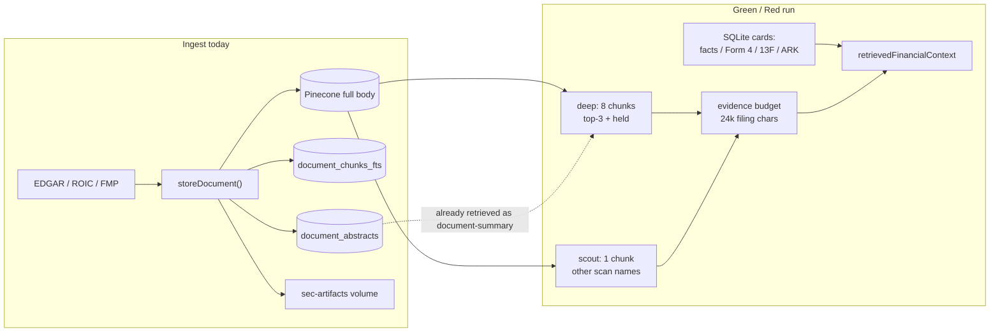
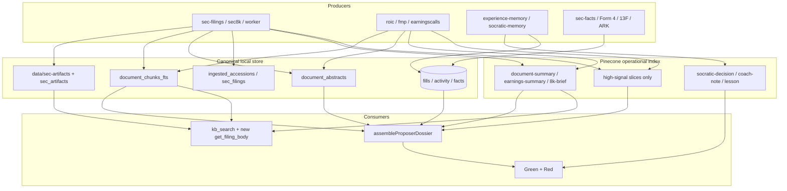
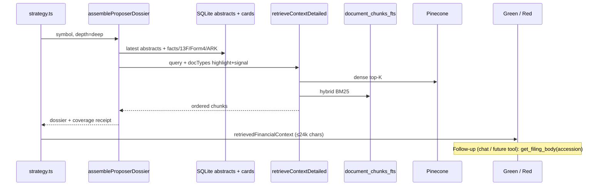

# Proposer Corpus Storage: Highlights in Pinecone, Full Documents Local

| Field | Value |
| --- | --- |
| Status | Draft |
| Date | 2026-08-16 |
| Author | Grok (design only; no product-code change) |
| Branch | `grok/prod-error-triage-48h` |
| Worktree | `~/apps/trading-grok-error-triage-48h` |
| Audience | Senior engineers who already know `storeDocument`, the Green/Red loop, and the Pinecone trial fuse |

## Overview

Green and Red do not read filings.  They read a **bounded dossier**: structured SQLite cards plus a handful of retrieved chunks, already capped at 8 for deep names (top-3 scan + held) and 1 for scout names (`src/lib/strategy.ts`), then truncated again by the shared evidence budget (24,000 filing characters / 6,000 tokens).  The current ingest path nevertheless upserts **every 10-K/10-Q/8-K/transcript chunk** into Pinecone, then mirrors the same text into `document_chunks_fts`.  A single large filing is ~175 chunks / ~2,698 estimated write units.  That is what burns the trial and what will not fit the post-trial 60k WU/day snap.

The proposed store is a **three-layer corpus** that matches how proposers actually consume data:

1. **Canonical document store** (already exists): raw HTML/text on the local volume (`data/sec-artifacts/…`), `sec_artifacts` + `ingested_accessions` + `earningscalls_transcripts` receipts, and full chunk text in `document_chunks_fts`.
2. **Operational retrieval index** (change the write set): Pinecone keeps compact `document-summary` / `earnings-summary` / `8k-brief` vectors plus a **bounded high-signal slice** (MD&A, Item 1A, Item 2.02, prepared remarks), not every boilerplate page.
3. **Prompt assembly** (small change): prefer the SQLite abstract, then 2–4 high-signal chunks, still ordered by `orderChunksForProposer`.  App-owned performance, fills, activity, and experience-memory stay **full records** in SQLite (and the existing compact episodic vectors).

No ingest-path LLM summarizer.  Extractive highlights (`DOCUMENT_HIGHLIGHT_MODEL = extractive-highlights-v2` in `src/lib/rag/document-summarizer.ts`) already write both `document_abstracts` and the compact Pinecone doc types.  That is sufficient unless a later gold-set proves otherwise, and any generative upgrade must be separately budgeted.

## Background & Motivation

### How proposers actually use the corpus



Verified in this worktree (do not treat older design docs as current):

- `src/lib/strategy.ts` (~1365–1418): `deepSymbols = topCandidates.slice(0, 3) ∪ heldSymbols` retrieve **8** chunks; every other scan candidate retrieves **1**.  Query is `deterministicFilingsRetrievalQuery` from `src/lib/rag/information-routing.ts`.
- `src/lib/rag/proposer-format.ts`: `orderChunksForProposer` puts `document-summary` / `earnings-summary` / `*-brief` first.
- `src/lib/strategy.ts` (~5179–5187): variable-length prose shares one budget.  Filings family is **24,000 characters / 6,000 tokens**.  Global cap is 48,000 / 12,000.  Excess is omitted with a receipt, not silently stuffed.
- Red Team receives the **same** `retrievedFinancialContext` (comment at `strategy.ts:5621–5622`).  There is no second filings retrieve for the critic.
- Chat Coach uses `kb_search` → `retrieveContextDetailed` (`src/lib/chat/orchestrator.ts`).  There is **no** accession-body tool today.
- Structured facts never go through embeddings: `formatCompanyFactsEvidenceCard`, `formatInsiderTransactionsEvidenceCard`, `formatThirteenFEvidenceCard`, `formatArkEvidenceCard` are SQLite cards injected next to the RAG block.

### What ingest already writes

| Layer | Where | Who writes it |
| --- | --- | --- |
| Full 10-K/10-Q body chunks | Pinecone **and** `document_chunks_fts` | `ingestFiling` in `src/lib/web-sources/sec-filings.ts` |
| Extractive highlights | Pinecone `document-summary` **and** `document_abstracts` | `generateAndStoreDocumentAbstract` after ingest; `maybeRefreshSecFilingAbstract` upgrades old model rows without re-fetching EDGAR |
| Raw HTML | `data/sec-artifacts/{cik}/{accession}/…` + `sec_artifacts` | `writeLocalArtifact` / `insertSecArtifact` |
| 8-K body + `8k-brief` | Pinecone + FTS + abstracts | `src/lib/web-sources/sec8k.ts` |
| ROIC / EarningsCalls transcripts + `earnings-summary` | Pinecone + abstracts | `roic-transcripts.ts`, `earningscalls-transcripts.ts` |
| FMP transcripts | Pinecone full body only | `fmp-transcripts.ts` — **no abstract writer** (gap) |
| Experience / lessons | Pinecone `socratic-decision` / `coach-note` / `lesson` | `experience-memory.ts` (already compact state vectors) |
| Fills / activity / performance | SQLite only | `db-fills.ts`, `db-execution.ts`, `performance.ts` |

Highlights are **deterministic**.  `tradeHighlightChunksFromText` scores paragraphs with keyword/numeric/section priors, diversity-caps Jaccard 0.55, and emits at most 8 × 1,800 characters.  `DOCUMENT_HIGHLIGHT_MODEL` is bumped when the algorithm changes so old abstracts rewrite once.

### Why the current write set is wrong for the remaining trial and the free-tier snap

- Pinecone trial: ~$238 of $300 left as of 2026-08-16, ends `2026-08-30T00:00:00.000Z` (`PINECONE_CURRENT_TRIAL_ENDS_AT`).  List price used for pacing is **$4 / 1M WU**.  Remaining credit ≈ **59.5M WU**; `$45` reserve ≈ 11.25M WU.
- App fuse during trial: **2.5M WU / rolling 24h**.  After snap: **60k WU/day**, **20k texts/day**, monthly pace **1.6M WU** (`src/lib/pinecone-trial-window.ts`).
- Live receipt on this branch: one skipped batch was **175 items / 2,698 estimated WUs** — one large filing hitting an already-spent fuse (`docs/rollouts/2026-08-16-prod-error-triage-48h.md`).
- WU estimate (`estimatePineconeRecordWriteUnits` in `vector-db.ts`): `ceil((id + metadata + 1024×4 + 512) / 1024)`.  Metadata carries chunk text / parent context up to the 40,896-byte soft cap, so real cost is ~**15 WU/chunk**, not the legacy 5 WU/record.
- Hybrid retrieval already queries `document_chunks_fts` (`search-fusion.ts`, `corpus-wide-lexical.ts`).  Dropping full-body vectors from Pinecone does **not** drop lexical recall of those bodies.
- `information-routing.ts` still *asks* for `["10-k","10-q","8-k","document-summary"]` and `["earnings-transcript","earnings-summary"]`.  That declaration is why full bodies keep winning slots that the 24k-char budget then truncates.

The 2026-07-12 1,000-issuer plan (`docs/reviews/2026-07-12-sec-rag-1000-stock-backfill-plan.md`) already said “do not turn every filing byte into a vector.”  The trial activation then did exactly that, because the write path has no “highlight-only” mode.  This design is the missing write policy, not a new vendor.

## Goals & Non-Goals

### Goals

- Give Green/Red a **complete highlight** for every filing/transcript type they are allowed to see, plus enough high-signal narrative to cite a section.
- Cover **latest** 10-K + latest 10-Q + latest 8-K + latest transcript for as many in-universe names as possible before spending WUs on history.
- Deepen history (extra quarters, prior 10-K, extra transcripts) for **held / watchlist / technical-watchlist** names (`rankHighInterestSymbols`).
- Keep Pinecone inside the **post-trial 60k WU/day** envelope for incremental ingest (new 8-Ks and new calls), not just for a one-time backfill.
- Preserve a named accession so a reviewer or a later proposer follow-up can load the **full body on demand** from disk/SQLite/EDGAR.
- Leave app-owned performance, fills, activity, and experience-memory **full** (or at least fully available; a summary may exist beside them, never instead of them).

### Non-Goals

- No new vector vendor, no pgvector migration, no R2-as-primary document store in this design.  R2 remains the weekly SQLite cold snapshot.
- No ingest-path generative LLM.  Do not put LLM runtime keys in Infisical to “summarize 10-Ks.”
- No change to Green/Red evidence parity.  They keep sharing one dossier.
- No PWA work.
- No claim that extractive highlights are as good as a human MD&A brief.  They are the cost-bounded default; a later eval can reopen that.
- No mass delete of existing Pinecone full-body vectors on day one.  Stop *new* waste first; prune later if WU or storage pressure requires it.
- No paternalistic “protect the owner from a real-money trade because the abstract is short.”  Missing coverage is a **receipt**, not a block.

## Proposed Design

### Target architecture



### Layer 1 — Canonical documents (source of truth)

Reuse what is already on disk and in SQLite.  Do not add a vendor.

| Asset | Store | Identity |
| --- | --- | --- |
| Raw filing HTML | `data/sec-artifacts/{paddedCik}/{accession}/{seq}-{doc}` via `readLocalArtifact` / `writeLocalArtifact` | CIK + accession + sequence + document name |
| Artifact receipt | `sec_artifacts` (`accession, sequence, document_name, sha256, byte_count, raw_uri, parser_version`) | Same |
| Full chunk text | `document_chunks_fts` (FTS5: `content_hash, symbol, source, accession, text`) | content_hash + symbol + source + accession |
| Ingest ledger | `ingested_accessions (accession, doc_type)` and `sec_filings` | accession + form |
| Transcript cache | `earningscalls_transcripts.content` (immutable once non-null) | symbol + fiscal year/quarter |
| Compact highlight | `document_abstracts` (`headline`, `summary_text`, `source_chunk_ids`, `model_used`) | `accession_or_event_id` + `source_type` |
| Structured cards | existing company-facts / insider / 13F / ARK tables | CIK / ticker |
| Fills, activity, lots | existing execution/fill tables | proposal / fill id |

On-demand body resolution order (new helper, no new store):

1. `readLocalArtifact` / `earningscalls_transcripts.content` / FTS join on accession.
2. If missing, `fetchFilingHtml` from the `sec_artifacts.raw_uri` or EDGAR directory, then write the artifact so the next call is local.
3. Return text + accession + form + filedAt.  Never invent numbers.

This is allowed by the owner constraint: retrieval names the accession, then a follow-up may fetch the body.

### Layer 2 — Pinecone write policy (the actual change)

Introduce an explicit **Pinecone write class** on each producer.  Default after the trial snap is `highlight+signal`.  During the remaining trial, latest-only coverage of highlights is the first spend; full-body upserts are optional and **ranked last**.

```ts
/** What storeDocument is allowed to upsert for a market document. */
export type PineconeWriteClass =
  | "full-body"          // today's behavior (trial leftover / explicit override)
  | "highlight-only"     // document-summary / earnings-summary / 8k-brief only
  | "highlight+signal";  // highlight plus a bounded high-signal slice

export const PINECONE_SIGNAL_SECTIONS: Record<string, string[]> = {
  "10-k": ["1A", "7", "7A", "8"],          // Risk Factors, MD&A, Market Risk, Financials
  "10-q": ["2", "1A", "3"],                // MD&A, Risk Factors, Legal
  "8-k": ["2.02", "5.02", "1.01", "8.01"],
  "earnings-transcript": ["prepared", "qa"]
};
```

**What stays in Pinecone forever**

- `document-summary`, `earnings-summary`, `8k-brief` (one logical document, typically 1–3 vectors).
- High-signal child chunks whose `section` / `itemCode` matches the table above, capped (proposed: **12 chunks or 20k characters of source text**, whichever first).  These are the chunks retrieval actually needs when the abstract is not enough.
- `socratic-decision`, `coach-note`, `lesson`, and any other experience-memory / owner-coaching vector.  These are already compact state sketches (`experience-memory.ts`), not 10-K pages.  Do not highlight-replace them.
- Fundamentals cards (`doc_type: "fundamentals"`) stay as today — they are one short vector.

**What leaves the Pinecone *write* path (new documents)**

- The remaining 10-K/10-Q body (exhibits boilerplate, signatures, certifications, repetitive XBRL prose).
- Full earnings-call Q&A after the prepared-remarks + first-pass Q&A signal cap.
- Historical 10-K bodies for names that already have a latest-year highlight.

Those pages remain in FTS + artifacts.  Hybrid retrieval (`routeRetrievalIntent` → FTS5) still finds “Item 8 goodwill impairment $412 million” by exact phrase.

**What we do not put in Pinecone at all** (already true, keep it)

- Company facts, Form 4, 13F, ARK: SQLite cards.
- The fill tape, order blotter, and activity feed: SQLite.  A closed-lot *experience vector* may exist in addition, never as a substitute for the fill row.

### Layer 3 — Dossier assembly (how Green/Red see it)

Replace “retrieve 8/1 chunks of whatever `filing_narrative` names” with a **summary-first assembler** that still uses `retrieveContextDetailed` for the signal slice.

```ts
export interface ProposerDossier {
  symbol: string;
  depth: "deep" | "scout";
  abstracts: Array<{ accession: string; sourceType: string; headline: string; summaryText: string }>;
  chunks: RetrievedChunk[];          // already orderChunksForProposer'd
  factsCard: string;
  insiderCard: string;
  coverage: { want: string[]; have: string[]; missing: string[] };
}

export async function assembleProposerDossier(symbol: string, depth: "deep" | "scout"): Promise<ProposerDossier>
```

Assembly rules:

1. Load up to **N latest abstracts** from `getDocumentAbstractsForTicker` (proposed: deep = 4 types × latest 1; scout = latest 1 of any type).  These do **not** cost a Pinecone write and do not require the abstract to also be a retrieved vector.
2. Run the existing dense+hybrid retrieve with `docType` narrowed to `document-summary`, `earnings-summary`, `8k-brief`, plus the high-signal native types.  Keep `orderChunksForProposer`.
3. Deep remaining slots (8 − abstracts_already_inlined) fill from retrieved signal chunks, **deduped** against abstract `source_chunk_ids` so the model does not see the same MD&A paragraph twice.
4. Scout stays 1 unit: prefer the newest abstract; if none, one retrieved chunk.
5. Structured cards unchanged.
6. Emit a coverage receipt (`have` / `missing` latest 10-K, 10-Q, 8-K, transcript).  Advisory only.

Update `strategyInformationRouting` so `filing_narrative` defaults to `["document-summary","8-k","10-k","10-q"]` with summaries first in the filter list, and `earnings_transcript_narrative` to `["earnings-summary","earnings-transcript"]`.  The assembler, not the filter order, is the real gate.

Chat / human reviewer follow-up: add `get_filing_body({ accession, symbol })` next to `kb_search`.  It calls the Layer-1 resolver and returns a **bounded** body (proposed: 20k characters + section index), not a 10 MB HTML dump into the Coach context window.

### Coverage policy (what we ingest, in what order)

Already half-built:

- `rankDemandFirstSymbols` / `rankHighInterestSymbols` (`demand-first-symbols.ts`).
- `sortBreadthFirst` (`sec-filings.ts`): newest 10-K, newest 10-Q, second 10-Q, … leftover history last.
- ROIC two-pass: `phase: "latest"` then deepen held/watchlist (`roic-transcripts.ts`).
- SEC seeder baseline: latest 10-K + latest 4 10-Qs (`SEC_INGEST_BASELINE_CORPUS_REVISION`).

Make the **same two-pass contract** universal and WU-aware:

| Pass | Who | Documents | Pinecone class |
| --- | --- | --- | --- |
| A. Latest-only | Entire 1,000-issuer manifest + policy universe | latest 10-K, latest 10-Q, latest material 8-K, latest transcript | `highlight+signal` |
| B. Deepen | `rankHighInterestSymbols` only | extra 10-Qs, prior 10-K, extra transcripts (ROIC Individual 20 quarters already capped) | `highlight+signal` |
| C. Trial leftover only | whatever WU remains above the $45 reserve after A+B | optional `full-body` for held names | `full-body` |

Pass C is how we “use the trial” without painting ourselves into a free-tier hole.  After 2026-08-30, Pass C is off.

### Quantified budgets

Assumptions (pinned to code, not marketing):

- 1,000-issuer frozen manifest (`universe-manifest.ts` default `expectedIssuerCount`).
- High-interest set ≈ 30–150 names (holdings + watchlists + technical watchlist).  Use **150** as the planning ceiling.
- 10-K ≈ 175 chunks / 2,698 WU (live receipt).  10-Q ≈ 80 chunks / ~1,200 WU.  8-K ≈ 20 / ~300.  Transcript ≈ 40 / ~600.
- Highlight document ≈ 8 × 1,800 chars + headline ≈ 15 kB → typically **1–3 vectors / 15–50 WU**.
- High-signal slice ≈ 8–12 chunks / ~150 WU.
- Combined `highlight+signal` ≈ **180 WU per document**, **~720 WU per name** for four latest documents.
- Prompt: 4 chars/token (`evidence-budget.ts` default).  One maxed highlight = 14,400 chars ≈ 3,600 tokens.  Typical filled highlight after diversity is closer to 6–10k chars ≈ 1,500–2,500 tokens.

#### Write units

| Scenario | WU | Trial 2.5M/day | Free 60k/day |
| --- | --- | --- | --- |
| 1,000 names × latest 10-K **full body** | 2.7M | ~1.1 days | **45 days** (and that is only 10-Ks) |
| 1,000 names × latest four docs **full body** | ~4.8M | ~2 days | **80 days** |
| 1,000 names × latest four docs **highlight+signal** | ~720k | <1 day | **12 days** |
| 1,000 names × latest four docs **highlight-only** | ~80–200k | <1 day | **2–4 days** |
| Deepen 150 names × ~8 extra docs highlight+signal | ~216k | <1 day | **4 days** |
| Incremental day (≈30 new 8-Ks + 20 new calls, highlight+signal) | ~9k | noise | **fits easily** (15% of daily fuse) |
| Historical every 10-K body for 1,000 names × 5 years | ~13.5M | 5.4 days | **225 days** — this is the trap |

Remaining trial credit above the $45 reserve is ~$193 ≈ **48M WU**.  That is enough to full-body the universe several times.  The binding constraint is **not** “can the trial finish latest-only full bodies?”  It can.  The binding constraint is **what we are stuck hosting and refreshing after Aug 30**.  Every full-body 10-K we write now is a vector we cannot afford to re-embed or to keep expanding.

#### Prompt tokens (one strategy run)

| Dossier shape | Deep name (chars / tokens) | Scout name | 3 deep + 20 scout |
| --- | --- | --- | --- |
| Today, 8 raw body chunks @ 1,800 | 14.4k / 3.6k | 1.8k / 0.45k | **79k chars** — **already over** the 24k filings family budget, so most scout/deep text is omitted |
| Today, summaries-first (already merged on this branch) | still 8 slots; summaries occupy the first | 1 slot | better, but a 10-K page can still fill remaining deep slots |
| Proposed: 1–4 abstracts + ≤4 signal chunks deep; 1 abstract scout | ~12–16k / 3–4k deep, but **shared** abstracts are shorter in practice (~8k / 2k) | ~6–10k / 1.5–2.5k if we inline a full abstract, or we cap scout at 2.5k | **fits the 24k family budget** if scout abstracts are truncated to ~800–1,200 chars |

The 24k-char filings budget is the real proposer interface.  Designing Pinecone around “the LLM might want the whole 10-K” is paying WUs for text the evidence budget will drop.

#### SQLite / disk

| Store | Latest-only 1,000 names | Notes |
| --- | --- | --- |
| `document_chunks_fts` full text | ~1.0–1.5 GB | 175 × ~2 KB × 1,000 10-Ks ≈ 350 MB, plus 10-Q/8-K/transcripts |
| `document_abstracts` | ~50–80 MB | 14 KB × 4 types × 1,000 |
| Raw HTML artifacts | **2–10 GB** | already written by `writeLocalArtifact`; 160 GB NVMe box, `/` ~45% used as of 2026-08-11 |
| Experience / fills | unchanged | not duplicated into Pinecone as filings |
| Current R2 weekly snapshot | 4.67 GB (`app-2026-08-16.db`) | FTS + artifacts growth is the term to watch; artifacts are **files**, not SQLite, unless we later choose to inline them |

FTS already holds the body.  Stopping Pinecone full-body writes does **not** grow SQLite.  It stops a second, more expensive copy.

### Sequence: one deep name on a strategy run



## API / Interface Changes

No public HTTP API for trading users.  Additive internals + one Coach tool + admin receipts.

### New / changed functions (proposed homes)

| Function | File | Change |
| --- | --- | --- |
| `pineconeWriteClass()` | new `src/lib/rag/pinecone-write-class.ts` | reads `RAG_PINECONE_WRITE_CLASS` (`full-body` \| `highlight+signal` \| `highlight-only`), default `full-body` during trial calendar, `highlight+signal` after snap |
| `selectSignalChunks(chunks, formHint)` | same | filters `chunkDocument` output before `storeDocument` when class ≠ `full-body` |
| `assembleProposerDossier` | new `src/lib/rag/proposer-dossier.ts` | SQLite abstracts + retrieve |
| `resolveFilingBody(accession)` | `src/lib/web-sources/sec-filings.ts` | local artifact → FTS → EDGAR |
| `get_filing_body` | `src/lib/chat/tools.ts` | Coach tool, read-only, 20k char cap |
| `strategyInformationRouting` | `information-routing.ts` | document type lists put summaries first (comment already claims this) |
| Admin `/api/admin/rag-coverage` | existing route | add `store: "pinecone" \| "fts" \| "abstract"` counts and trial-window already present |

`storeDocument` itself does **not** grow a second code path for embeddings.  Producers slice the `ChunkInput` they pass in.  That keeps the managed-commit ledger, WU fuse, and `documentComplete` proof unchanged.

### Prompt contract

`retrievedFinancialContext` stays the field name.  Each dossier header should name accessions so a later tool call can resolve them:

```
### RAG Dossier for NVDA
[document-summary · NVDA · 2026-05-28 · acc 0001045810-26-000123]
...extractive highlights...
[10-K · Item 7 MD&A · NVDA · 2026-05-28 · rel 0.81]
...signal chunk...
```

`formatChunkWithProvenance` already prints doc_type / section / symbol / date / rel.  Add accession when `metadata.accession` is present (small, independently mergeable).

## Data Model Changes

**No new vendor tables.**  One optional additive column if we want coverage queries without parsing Pinecone:

```sql
-- optional, PR-sized, only if admin coverage cannot derive this from ingested_accessions.chunk_count
ALTER TABLE ingested_accessions ADD COLUMN pinecone_write_class TEXT NOT NULL DEFAULT 'full-body';
```

Prefer **not** shipping that in the first PR.  `document_abstracts.model_used`, `ingested_accessions.chunk_count`, and FTS row counts already distinguish “body mirrored” from “highlight exists.”

`document_abstracts.source_type` stays `"10k-delta" | "10q-delta" | "earnings-summary" | "8k-brief"`.  FMP transcripts should start writing `earnings-summary` like ROIC/EarningsCalls.

No migration of existing Pinecone ids.  Old full-body vectors remain retrievable until an explicit prune PR.

## Alternatives Considered

### A. Keep embedding every body (status quo)

- **Pros:** Dense ANN can theoretically surface an obscure footnote; no producer changes; trial dollars get spent.
- **Cons:** 4.8M WU for latest-only four-doc coverage; 80 free-tier days to rebuild; 8-chunk deep pass + 24k budget already drop most of those vectors on the floor; this is the path that tripped the 2.5M fuse while $238 remained.
- **Verdict:** Acceptable only as Pass C (trial leftover on held names).  Not the steady state.

### B. LLM-summarize every document on ingest

- **Pros:** Possibly better prose than extractive highlights; can emit structured guidance/drivers/risks into the unused `guidance_json` / `drivers_json` / `risks_json` columns.
- **Cons:** Blocks volume (one LLM call per filing); costs OpenRouter tokens on the ingest path; requires an LLM runtime key the owner just banned from Infisical; ungrounded numbers become “facts” (explicitly rejected in `docs/design/earnings-rag.md`).
- **Verdict:** Rejected unless a gold-set shows extractive highlights miss catalysts **and** the call is bounded (e.g. 8-K Item 2.02 only, daily cap).  Even then the LLM output is a **child** of the extractive abstract, never the only store.

### C. Pinecone-only highlights, no FTS body

- **Pros:** Smaller disk.
- **Cons:** Loses exact-phrase recall the hybrid stack already depends on; on-demand fetch would always hit EDGAR; contradicts “prefer existing tables.”
- **Verdict:** Rejected.

### D. Move the vector index to SQLite/sqlite-vec

- **Pros:** Zero Pinecone WU after migration.
- **Cons:** New operational surface on the 16 GB Hetzner box; no managed ANN; full re-embed; fights the existing trial/fuse/receipt machinery.
- **Verdict:** Out of scope.  Revisit only if free-tier WU cannot hold incremental `highlight+signal` (~9k/day).  That bar is not close.

### E. Proposed: local canon + operational Pinecone (`highlight+signal`)

- **Pros:** Matches the 8/1 dossier and the 24k budget; FTS keeps lexical recall; trial leftover can still full-body held names; free-tier incremental ingest fits; no new vendor; extractive path already shipped.
- **Cons:** Dense recall of non-signal sections weakens; must keep artifact/FTS durability honest; FMP abstract gap must close or those names look empty to the assembler.
- **Verdict:** This design.

## Security & Privacy Considerations

- Filings and transcripts are **shared, app-funded** (`userId='local'` → `scope:'shared'`).  That does not change.  Do not copy private experience-memory into the shared highlight path.
- Experience-memory and coach notes stay on the existing tenant/scope filters.  A highlight rewrite must never re-scope a private lesson to `shared`.
- `get_filing_body` is read-only and session-auth like `kb_search`.  It returns public EDGAR/transcript text, still prompt-injection-untrusted (`containPromptText` source `"rag"`).
- FMP transcript rights (`FMP_TRANSCRIPT_STORAGE_RIGHTS_CONFIRMED`) still gate **display and retrieval** of FMP-derived text.  An extractive abstract of an FMP body is still FMP-derived and must carry the same rights claim (`fmpDerivedProvenance` already exists on the strategy path).
- On-demand EDGAR fetch uses the existing `secUserAgent` + polite limiter.  Do not open a parallel unthrottled fetch from the Coach tool.
- No new secrets.  No Infisical LLM keys.

## Observability

Emit or extend (all advisory):

| Signal | Where | Why |
| --- | --- | --- |
| `pinecone_write_class` on `sec_filing_ingest` / `roic_transcript_ingested` audits | existing `audit(...)` payloads | prove a document did not silently full-body after snap |
| WU per `doc_type` on `/api/admin/rag-coverage` | route already has `trialWindow` | catch “we are embedding 10-K bodies again” |
| Abstract coverage: tickers missing `document_abstracts` for latest 10-K/10-Q/transcript | same route | Pass A completeness |
| FTS-vs-Pinecone chunk count per accession | admin only | detect “highlight in SQLite, nothing retrievable” |
| Dossier `coverage.missing` on `rag_retrieval_status` | strategy already persists typed status rows | Green/Red honesty |
| Daily incremental WU vs 60k | existing fuse + Sentry 6h dedup | already works; do not raise the fuse |

Do not page on “abstract shorter than 80 chars” as a trading halt.  That is a skip (`summary_too_short`) and a coverage hole.

## Rollout Plan

Split by **calendar**, not by hope.

### During the remaining trial (now → 2026-08-30, full-steam until ~$45)

1. Do **not** raise `RAG_PINECONE_MAX_WRITE_UNITS_PER_DAY` above 2.5M.
2. Finish **Pass A** (latest highlight+signal for the 1,000-name universe + policy universe) before any historical 10-K body.
3. Close the FMP abstract gap so every transcript producer writes `earnings-summary`.
4. Prefer `sortBreadthFirst` / ROIC `phase: "latest"` / demand-first rank.  Already on this branch for filings+ROIC.
5. Spend leftover trial WU above the reserve on **Pass B** (held/watchlist history as highlight+signal), then optional **Pass C** full-body for currently held names only.
6. Keep retrieval unchanged until the assembler PR lands.  Summaries-first ordering is already in `orderChunksForProposer`.

### After the free-tier snap (2026-08-30, automatic in `pinecone-trial-window.ts`)

1. Effective caps: 60k WU/day, 20k texts/day, 1.6M WU/month if `PINECONE_MONTHLY_WU_BUDGET` is unset.
2. Default write class becomes `highlight+signal`.  `full-body` requires an explicit env override.
3. Incremental producers (8-K, new 10-Q, new call) must preflight `hasPineconeWriteBudget` (already wired on this branch).
4. Do not start a corpus-wide re-embed.  Old full-body vectors remain until a later prune PR.
5. Deepen history only for `rankHighInterestSymbols`, and only as highlights.

### Rollback

- Set `RAG_PINECONE_WRITE_CLASS=full-body` (or delete the env) to restore today’s upsert set.  FTS and artifacts are unchanged either way.
- Assembler behind a default-on flag `RAG_PROPOSER_DOSSIER=off` restores the raw 8/1 `retrieveContextDetailed` loop.
- Trial calendar off: `PINECONE_TRIAL_ENDS_AT=off` (already documented).  Does not restore full-body writes if the write-class default has snapped.

## Key Decisions

1. **Canonical store is local SQLite + the sec-artifacts volume.**  Pinecone is an operational index, not the document archive.  Full 10-K/10-Q/transcript text already lives in `document_chunks_fts` and `data/sec-artifacts/`.  We stop pretending a third copy in Pinecone is required for Green/Red.
2. **No ingest-path LLM.**  `extractive-highlights-v2` is the highlight engine.  A generative brief is out of scope until a gold-set shows the extractive path misses trade-relevant facts **and** the extra spend is capped.
3. **Every filing/transcript type gets a compact highlight.**  10-K → `10k-delta` / `document-summary`.  10-Q → `10q-delta`.  8-K → `8k-brief`.  Transcripts → `earnings-summary`.  FMP is the missing writer and must be closed.  App-owned fills, activity, performance, and experience-memory are the explicit exception: full records stay in SQLite; episodic vectors stay full state sketches.
4. **Pinecone write class defaults to `highlight+signal` after the trial.**  Highlight plus MD&A / Item 1A / Item 2.02 / prepared-remarks (capped).  Not highlight-only (dense recall of the catalyst section still matters) and not full-body (WU math).
5. **Proposer dossier is SQLite-abstract-first, then a few retrieved signal chunks.**  Deep = 8 slots, scout = 1 slot, filings family = 24k chars.  `orderChunksForProposer` stays.  Green and Red keep evidence parity.
6. **Coverage is latest-only universe, then deepen high-interest names.**  Same shape ROIC already uses.  Historical full-body 10-K embedding is how you burn a trial and then cannot refresh.
7. **On-demand body fetch is a named-accession follow-up, not a prompt default.**  Local artifact, then FTS, then polite EDGAR.  Coach tool `get_filing_body`.  Optional later Green/Red tool if a run needs a cited accession.
8. **Prefer existing tables over a new store.**  `document_chunks_fts`, `document_abstracts`, `sec_artifacts`, `ingested_accessions`, `earningscalls_transcripts`.  Optional `pinecone_write_class` column only if coverage queries need it.
9. **Trial dollars buy coverage breadth, not a second copy of Item 15 exhibits.**  Full-steam until ~$45 remains (`PINECONE_TRIAL_RESERVE_USD`).  After snap, 60k WU/day is enough for incremental highlights (~9k/day) plus a slow deepen.
10. **Missing corpus is a receipt, never a trade block.**  Harden correctness of *what was shown*, not obedience.

## PR Plan

Each PR is independently mergeable, has its own tests, and can ship if the next one never lands.

### PR 1 — Write-class knob + coverage honesty (no ingest behavior change by default)

- Add `src/lib/rag/pinecone-write-class.ts` with parser + `selectSignalChunks` unit tests against fixture 10-K sections.
- Default **`full-body`** while `isPineconeTrialActive()` so we do not silently stop mid-trial without an explicit flip.
- Extend `/api/admin/rag-coverage` with abstract counts and FTS-vs-ledger counts.
- Docs: this file + a short rollout note.
- **Verify:** unit tests for the classifier and `selectSignalChunks`; existing coverage tests updated.
- **Rollback:** delete the module; admin fields are additive.

### PR 2 — FMP (and any other) missing abstract writer

- After a successful `storeDocument` in `fmp-transcripts.ts`, call `generateAndStoreDocumentAbstract` exactly like `roic-transcripts.ts` / `earningscalls-transcripts.ts`.
- Respect FMP rights: abstract is FMP-derived; keep provenance.
- Backfill: a bounded worker that upgrades `abstractNeedsUpgrade` for already-ingested FMP accessions from local/cached content only (no new FMP spend if the body is already on disk/SQLite).
- **Verify:** `test/fmp-transcripts.test.ts` asserts an `earnings-summary` row + `document_abstracts` insert on a fixture body.
- **Independence:** valuable even if we never change Pinecone write class.

### PR 3 — `assembleProposerDossier` behind `RAG_PROPOSER_DOSSIER` (default on after tests, flag-off rollback)

- New `src/lib/rag/proposer-dossier.ts`.  `strategy.ts` calls it instead of the inline 8/1 loop when the flag is on.
- SQLite abstracts inlined first; retrieve still runs for signal/summaries; `orderChunksForProposer` retained.
- Coverage receipt folded into existing `ragRetrievalStatusRows`.
- Scout abstracts truncated to keep the 24k family budget honest (proposed 1,200 chars).
- **Verify:** new `test/proposer-dossier.test.ts` (abstract-only name, mixed, empty corpus).  Existing strategy RAG tests still pass with the flag off.
- **Independence:** works against today’s full-body index.

### PR 4 — Producers honor `highlight+signal` when the knob is set

- `ingestFiling`, `sec-ingest-worker` embed path, `sec8k` body path, ROIC/FMP/EarningsCalls: if class ≠ `full-body`, pass only highlight (already a separate `storeDocument`) + `selectSignalChunks` into the body `storeDocument`.
- **Always** run the current FTS mirror of the **full** `chunkDocument` output.  FTS is the body.
- `ingested_accessions.chunk_count` records full FTS cardinality, not the Pinecone subset (document this in the audit payload to avoid “175 vs 12” confusion).
- **Verify:** sec-filings + sec-ingest-worker tests: Pinecone attempted == signal slice; FTS rows == full chunk list; abstract still written.
- **Independence:** can land before or after PR 3.  Default knob still `full-body` until PR 6 or an operator flip.

### PR 5 — `get_filing_body` Coach tool + accession in provenance headers

- `resolveFilingBody` in `sec-filings.ts` (local → FTS → EDGAR).
- `get_filing_body` in `chat/tools.ts`, 20k char cap, section index when `parseFilingHtml` sections exist.
- `formatChunkWithProvenance` includes accession when present.
- **Verify:** chat tool tests + sec-filings resolver tests with a temp artifact file.
- **Independence:** useful today for Coach, even with full-body Pinecone.

### PR 6 — Post-trial default + optional held-name full-body leftover

- When `pineconeTrialState().mode === "free"`, `pineconeWriteClass()` defaults to `highlight+signal`.
- Env override still wins (`RAG_PINECONE_WRITE_CLASS=full-body`).
- Pass C helper: if trial is active AND Pass A coverage for the symbol is complete AND the symbol is in `rankHighInterestSymbols`, allow `full-body` for that document only.  After snap, this branch is dead.
- **Verify:** `test/pinecone-trial-window.test.ts` + write-class tests for free/trial/override.
- **Independence:** one-file default change once PR 4 exists.

### PR 7 — Optional prune of non-signal full-body vectors (do not start until Pass A is green)

- Inventory-only first (dry-run, like managed-vector-reconcile).  Delete Pinecone records whose `doc_type` is `10-k`/`10-q`/`earnings-transcript` **and** whose section is outside the signal table **and** whose accession has a current `document_abstracts` row.
- Never delete experience-memory / lesson / coach-note / fundamentals.
- Never delete FTS rows or artifacts.
- **Verify:** dry-run tests on a fixture occurrence set.  No production delete in the same PR as the inventory.
- **Independence:** skippable forever if storage is fine.

Land order recommendation: **1 → 2 → 5 → 3 → 4 → 6**, with 7 later.  2 and 5 can parallel 3.

## Open Questions

1. **Should scout inline a full 8-highlight abstract (~2k tokens) or a 1,200-char stub?**  Recommendation: stub + accession, because 20 scouts × 2k tokens blows the 24k budget.  Owner can pick “full abstract, fewer scouts.”
2. **Is the high-signal section list right?**  Item 8 (financial statements) is table-heavy and expensive in metadata bytes.  We may want Item 8 in FTS-only and keep Item 7 / 1A / 2.02 in Pinecone.
3. **Do we ever prune old full-body vectors?**  Only if index size or stale-duplicate retrieval becomes a measured problem.  Not required to hit 60k/day.
4. **Should Green/Red get a mid-run `get_filing_body` tool?**  Not in v1.  The strategy loop is already latency- and lock-sensitive.  Coach + human reviewer first.
5. **20-F / 6-K / 40-F** for foreign private issuers in the manifest: treat as 10-K / 8-K equivalents for highlight purposes.  Not in PR 1–6 unless a producer already fetches them.
6. **VECTOR_ASOF_STRICT** remains an owner flip (`FEATURE-ENABLEMENT-BACKLOG.md`).  This design does not depend on it.  Abstracts must keep `published_at` / `acceptance_datetime` so a future strict as-of still works.

## References

- `src/lib/strategy.ts` — 8/1 retrieve, evidence budget, Green/Red parity
- `src/lib/rag/proposer-format.ts` — summary-first sort
- `src/lib/rag/document-summarizer.ts` — extractive-highlights-v2
- `src/lib/rag/information-routing.ts` — declared needs
- `src/lib/rag/demand-first-symbols.ts` — holdings-first rank
- `src/lib/rag/fts-mirror-bound.ts` — why FTS is tick-sliced, not why we drop it
- `src/lib/web-sources/sec-filings.ts` — `ingestFiling`, `sortBreadthFirst`, local artifacts
- `src/lib/web-sources/roic-transcripts.ts` — latest-then-deepen
- `src/lib/web-sources/fmp-transcripts.ts` — full-body, no abstract
- `src/lib/vector-db.ts` — `storeDocument`, WU estimate, `formatChunkWithProvenance`
- `src/lib/pinecone-trial-window.ts` — trial calendar, $45 reserve, 60k snap
- `src/lib/experience-memory.ts` — episodic full-record exception
- `docs/design/earnings-rag.md` — do not replace raw evidence with an ungrounded LLM brief
- `docs/reviews/2026-07-12-sec-rag-1000-stock-backfill-plan.md` — “do not turn every filing byte into a vector”
- `docs/rollouts/2026-08-09-pinecone-trial-throughput-and-monthly-pace.md` — trial vs after knob table
- `docs/rollouts/2026-08-16-prod-error-triage-48h.md` — 175 chunks / 2,698 WU receipt

## Revision Summary

- 2026-08-16 — Initial draft.  Confirmed against `trading-grok-error-triage-48h` (`grok/prod-error-triage-48h`).  No product code changed.
