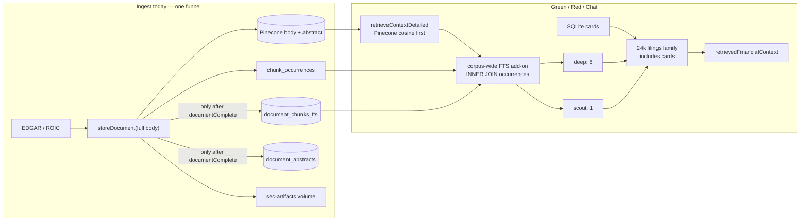
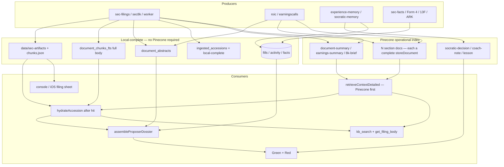
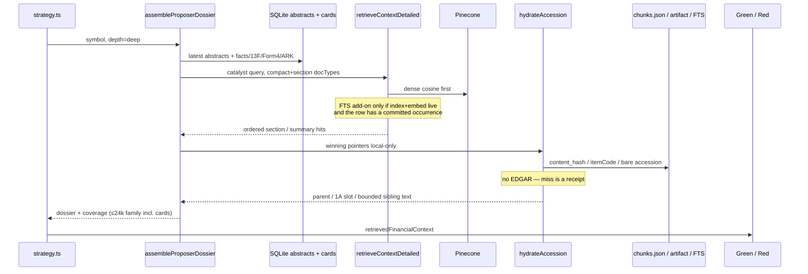

# Proposer Corpus Storage: Highlights in Pinecone, Full Documents Local

| Field | Value |
| --- | --- |
| Status | Approved (rev 3 — review 2026-08-16, 0 open issues).  Minimum PR A split landed 2026-08-18 (`cursor/hybrid-and-prune-7f41`); write-class still `full-body`. |
| Date | 2026-08-16 |
| Author | Grok (design only; no product-code change) |
| Branch | `grok/prod-error-triage-48h` |
| Worktree | `~/apps/trading-grok-error-triage-48h` |
| Audience | Senior engineers who already know `storeDocument`, the Green/Red loop, and the Pinecone trial fuse |

## Overview

Green and Red do not read filings.  They read a **bounded dossier**: structured SQLite cards plus a handful of retrieved chunks, already capped at 8 for deep names (top-3 scan + held) and 1 for scout names (`src/lib/strategy.ts`), then truncated again by the shared evidence budget (24,000 filing characters / 6,000 tokens).  Cards (facts / Form 4 / 13F / ARK) are concatenated into the same `ragContext` string today, so they share that 24k family budget.

The current **10-K / 10-Q / transcript** ingest path upserts **every body chunk** into Pinecone, then mirrors FTS **only after** `storeDocument` reports `documentComplete`.  8-K full-body upserts are a separate flag and default **off**; the default 8-K write is the extractive `8k-brief`.  A live worker filing was **933 chunks / 279s FTS**.  A fuse-skip receipt on this branch was 175 items / 2,698 estimated WUs — that is a mid-size document, not “a large 10-K.”  Managed commits charge **~2×** (`applyPineconeWriteBudget` when `isManagedCommit`).  Planning WU is ~8 pending / ~16 delivered per record.

The binding post-trial constraint is **Pinecone storage**, not the 60k WU/day write snap.  Free/Starter holds ~**2 GB ≈ 250k records ≈ ~350 full filings** (`docs/rollouts/2026-08-09-pinecone-trial-throughput-and-monthly-pace.md`).  Already-spent trial credit (~$62 ≈ 15.5M WU at $4/M) is on the order of **a million two-phase records** — already above a 250k free index.  “Stop new waste, prune later if storage is fine” and “live on free-tier after Aug 30” cannot both be true unless prune is a **calendar** step or the owner stays on **paid storage**.

The proposed store is still three layers, but the writer must **split** before anyone stops upserting bodies:

1. **Local-complete** (new seam): artifact HTML + full `document_chunks_fts` + `document_abstracts` persist **without** `storeDocument(full body)`.  `ingested_accessions` means this.
2. **Vector-index** (separate, small commits): Pinecone holds `document-summary` / `earnings-summary` / `8k-brief` plus a **capped high-signal section set**, each as its own complete `storeDocument`.  Never truncate a full-body commit.
3. **Prompt assembly**: SQLite abstracts first (1,200-char scout stub), then retrieved **section** vectors, then a **post-hit hydrate** from local FTS/artifacts on the money path.  Fills / activity / experience-memory stay full and purge-exempt.

No ingest-path LLM.  Extractive highlights (`DOCUMENT_HIGHLIGHT_MODEL = extractive-highlights-v2`) stay the highlight engine.

**Do not flip `RAG_PINECONE_WRITE_CLASS` off `full-body` until PR A (split writer + re-embed guard) and PR B (money-path hydrate) are both on `main`.**  Sequence is **A → B → Infisical flip**, then the 2026-08-30 write snap.  PR A lands inert (`full-body` default).  Flipping after A alone thins Green/Red (abstracts + 12 section vectors, no local parent/1A hydrate).  Stopping the body funnel before A makes new names go dark: today’s writer will not ledger, will not write the abstract, and will not create FTS-joinable occurrences.

## Background & Motivation

### How proposers actually retrieve (code, not intent)



Verified in this worktree:

- `src/lib/strategy.ts` (~1365–1418): `deepSymbols = topCandidates.slice(0, 3) ∪ heldSymbols` retrieve **8** chunks; every other scan candidate retrieves **1**.  Query is `deterministicFilingsRetrievalQuery` = “Significant financial events, SEC filings, and macro catalysts for $SYM”.
- Strategy and Coach call **`retrieveContextDetailed` only**.  They do **not** call `retrieveFusedContext` (`search-fusion.ts` is eval/tests).
- `retrieveContextDetailed` returns `[]` **before any FTS** if Pinecone or the embed key is missing (`vector-db.ts` ~6466–6473, status `lookup_failed`).
- `HYBRID_RETRIEVAL` (BM25 over the dense pool) defaults **off**.  `RAG_CORPUS_WIDE_LEXICAL` defaults **on** (`envFlagOn(..., true)` at `vector-db.ts:885`) despite a nearby comment that still says default-off.  Treat the **executable default** as production.
- Corpus-wide lexical is an **INNER JOIN** of `document_chunks_fts` to `chunk_occurrences` with `receipt_state` committed and `o.source IN ('sec-edgar','sec-8k')` (`corpus-wide-lexical.ts` ~302–322).  Occurrences are written inside the managed `storeDocument` commit, not by `insertDocumentChunkFts`.  FTS rows without a committed occurrence are **unjoinable orphans**.  Abstracts (`source=document-summarizer`) and every transcript producer are **excluded** from that join.
- `ingestFiling` / the worker / ROIC / EarningsCalls run FTS mirror, `insertIngestedAccession`, and `generateAndStoreDocumentAbstract` only after `documentComplete === true` and `indexed === attempted`.  You cannot `storeDocument` a 400-chunk 10-K and keep 12 vectors — completeness aborts.
- `orderChunksForProposer` puts `document-summary` / `earnings-summary` / `*-brief` first.
- Filings family budget: **24,000 characters / 6,000 tokens**.  Global 48,000 / 12,000.  Structured cards ride in the same `ragContext` hose.
- Red Team receives the **same** `retrievedFinancialContext`.  No second retrieve.
- Parent expansion defaults **on** (`RAG_PARENT_CONTEXT_EXPANSION`, `vector-db.ts:535`) and reads `parent_text` from **vector metadata**, not FTS.
- Chat `kb_search` is the same retrieve.  There is **no** accession-body tool and **no** console/iOS filing sheet.

### What ingest already writes

| Layer | Where | Who writes it | Notes |
| --- | --- | --- | --- |
| Full 10-K/10-Q body chunks | Pinecone **and then** `document_chunks_fts` | `ingestFiling`, `sec-ingest-worker` | FTS only after Pinecone complete |
| Extractive highlights | Pinecone `document-summary` **and** `document_abstracts` | after the body commit; `maybeRefreshSecFilingAbstract` upgrades old model rows | Behind the same funnel |
| Raw HTML | `data/sec-artifacts/{cik}/{accession}/…` + `sec_artifacts` | `writeLocalArtifact` / `insertSecArtifact` | Durable without Pinecone |
| Worker intermediates | `chunks.json`, `sections.json`, `storeResult.json` | `sec-ingest-worker.ts` | Best local body for on-demand |
| 8-K brief | Pinecone `8k-brief` + abstracts | default path (`WEB_SOURCE_SEC8K_FULL_BODY` defaults **off**) | Not a full-body write today |
| 8-K full body | Pinecone + FTS | only when that flag is on | Signal policy applies only then |
| ROIC / EarningsCalls transcripts + `earnings-summary` | Pinecone only (no body FTS) | after full-transcript `documentComplete` | **No lexical safety net** |
| FMP transcripts | Pinecone full body only | `fmp-transcripts.ts` | No abstract writer; not the live budget |
| Experience / lessons | Pinecone `socratic-decision` / `coach-note` / `lesson` | `storeContexts`, private, `matchAllSymbols` (no FTS) | Do-not-touch class |
| Fills / activity / performance | SQLite only | `db-fills.ts`, `db-execution.ts` | Never summarize |

Highlights are **deterministic**.  `tradeHighlightChunksFromText` scores paragraphs with keyword/numeric/section priors, diversity-caps Jaccard 0.55, and emits at most 8 × 1,800 characters.  `source_chunk_ids` today are synthetic `hl:1A:0` ids, **not** FTS `content_hash` values — they cannot hydrate.  `DOCUMENT_HIGHLIGHT_MODEL` is bumped when the algorithm changes so old abstracts rewrite once.  Abstracts must also regenerate when artifact `sha256` changes (amendments under the same accession).

### Why the current write set is wrong for the remaining trial and the free-tier snap

- Pinecone trial: ~$238 of $300 left as of 2026-08-16, ends `2026-08-30T00:00:00.000Z`.  List price used for pacing is **$4 / 1M WU**.  Remaining credit ≈ **59.5M WU**; `$45` reserve ≈ 11.25M WU.  Already spent ≈ **$62 ≈ 15.5M WU**.
- Configured Infisical fuse: **2.5M WU / rolling 24h**.  In full-steam phase `assessPineconeTrialWindow` sets `effectiveDailyWriteUnits = max(configured, paced)` — remaining ~59.5M / ~14 days ≈ **4.25M/day effective** while above the reserve.  Do **not** raise the Infisical env above 2.5M; the pacer already lifts the effective cap.
- After snap: **60k WU/day**, **20k texts/day**, monthly pace **1.6M WU**.
- **Storage (binding):** free/Starter ~2 GB / ~250k records.  A latest-1k full-body pass at 150–200 chunks is ~150–200k records (borderline).  Fat 10-Ks at 500–1,000 children are **500k–1M records** and will not fit.  Already-written trial vectors may already exceed 250k.
- Hybrid retrieval does **not** make FTS a backstop for bodies that were never committed to Pinecone.  Do not cite `search-fusion.ts` as live.
- `information-routing.ts` still *asks* for full `10-k`/`10-q`/`earnings-transcript` types.  That is why body pages still compete for the 8 slots the 24k budget then truncates.
- `corpus-reembed.ts` `reembedSecFilings` walks **every** `document_chunks_fts` `sec-edgar` row and `storeDocument`s it unless a live full-document commit exists in the current embed space.  An embed-model flip or `scripts/reindex-all.ts` after a highlight+signal cut is a silent undo and a free-tier WU bomb.

The 2026-07-12 1,000-issuer plan already said “do not turn every filing byte into a vector.”  The trial then did, because the write path has no split.  This design is the missing **writer split + keep-set**, not a new vendor.

## Goals & Non-Goals

### Goals

- Give Green/Red a **complete highlight** for every filing/transcript type they are allowed to see, plus enough high-signal **section vectors** that dense cosine can still surface a risk/guidance sentence the extractive scorer skipped.
- Cover **latest** 10-K + latest 10-Q + latest 8-K brief + latest transcript for as many in-universe names as possible before spending WUs or **storage** on history.
- Deepen history for **held / watchlist / technical-watchlist** names (`rankHighInterestSymbols`) as highlights + sections, not as extra full bodies.
- Size the **kept Pinecone corpus** to the plan we will actually pay for after 2026-08-30 (see Key Decision 1).  Incremental writes must fit 60k WU/day.
- Preserve a named accession so Chat, a console/iOS sheet, or a later hydrate step can load the **full body on demand** from disk/SQLite/EDGAR.
- Leave app-owned performance, fills, activity, and experience-memory **full** and **purge-exempt**.

### Non-Goals

- No new vector vendor, no pgvector, no R2-as-primary document store.  R2 remains the weekly SQLite cold snapshot.
- No ingest-path generative LLM.  Do not put LLM runtime keys in Infisical to “summarize 10-Ks.”
- No change to Green/Red evidence parity.
- No PWA work.
- No claim that extractive highlights are as good as a human MD&A brief.
- **No mass delete on day one, and no “prune later if we feel like it.”**  Existing full-body vectors stay until local FTS counts match and hydration is proven.  Then a **receipt-gated** prune, sized to the keep-set, is calendar-critical **if** we snap to free storage.  If that prune cannot land safely, **stay on paid storage** rather than evict blindly.
- **No Pass C full-body leftover.**  Spending remaining trial credit on bodies we have decided not to keep is a storage hangover.
- No paternalistic trade block on a short abstract.  Missing coverage is a **receipt**.
- No embed-model flip in this window.

## Proposed Design

### Target architecture



Live retrieve stays **Pinecone cosine first**.  Corpus-wide FTS is an add-on that cannot run without a live index/embed and cannot see FTS rows without committed occurrences.  After the cut, Green/Red/Chat **semantically** see abstracts + the capped section set.  Footnote recovery is **hydrate-from-pointer** (content_hash / itemCode / accession → local FTS / `chunks.json` / artifact), not “FTS as an equal sibling.”  Do not enable a local-only FTS join on the catalyst OR-query — that query compiles to `"Significant" OR "financial" OR "events" OR …` and would flood the 8-slot pool with boilerplate.

### Gate: do not stop full-body upserts until this checklist is green

All of these are **code**, not intent.

1. **Split writer.**  Local artifact + full FTS + abstract persist without `storeDocument(full body)`.  Abstract is no longer behind body `documentComplete`.
2. **New vector identity.**  `storeDocument` of abstract + N **section** docs, each small enough to complete.  Never truncate a full-body commit.
3. **Ledger split.**  `ingested_accessions` = local-complete.  Highlight/section commits live in `vector_ingest_commits` only.  Audit carries `pinecone_write_class` + `pinecone_vector_count`.
4. **Hydration on the money path (local-only).**  Strategy expands a highlight/section hit from `chunks.json` / local artifact / FTS.  **No EDGAR.**  Miss = receipt, fail-open.  Parent text comes from local parse, not Pinecone metadata.
5. **FTS search contract.**  Do **not** add local-only occurrences for the catalyst query.  Accept highlights+sections as the dense set.  Keep `RAG_CORPUS_WIDE_LEXICAL` on only for rows that still have Pinecone occurrences (legacy full bodies + new section docs).
6. **`corpus-reembed` updated in the same change.**  Default SEC pass re-embeds abstracts + selected section hashes only.  A highlight+signal accession is coverage for the whole filing; leftover FTS rows are **not** uploaded.
7. **Transcript exception.**  Latest call for high-interest names still has either full vectors **or** a real transcript FTS mirror.  Summary-only is not enough (ROIC/EarningsCalls do not write body FTS today).
8. **Experience-memory / fills / coaching** excluded from any purge (`DOC_TYPE_SOURCE_TAG` / legacy-purge exclusions in `corpus-reembed.ts`).
9. **Eval on `retrieveContextDetailed`**, same query, same 8/1 limits, same 6k filings budget, held+top-3 vs scout.  Do not promote from `retrieveFusedContext`.
10. **Abstract freshness.**  Regen on artifact `sha256` change and on amendment.  Reserve a deep Item 1A slot when a 10-K abstract is present.
11. **Existing full-body vectors stay** until FTS counts match `chunk_count` / `chunks.json` and hydration is proven.  Then receipt-gated prune sized to the keep-set.
12. **No embed-model flip** in this window.

If item 1 is false, stopping body upserts is an outage.  If item 4 is false, Green/Red get thinner than today with no way to recover a missed sentence.  If item 6 is false, the next re-embed undoes the cost win.

### Layer 1 — Local-complete (source of truth)

Reuse what is already on disk and in SQLite.  The **change** is that this layer must commit **before** and **without** a full-body Pinecone upsert.

| Asset | Store | Identity |
| --- | --- | --- |
| Raw filing HTML | `data/sec-artifacts/{paddedCik}/{accession}/{seq}-{doc}` | CIK + bare SEC accession + sequence + document name |
| Worker body | `chunks.json` / `sections.json` next to the artifact | Same |
| Artifact receipt | `sec_artifacts` | Same |
| Full chunk text | `document_chunks_fts` | content_hash + symbol + source + **bare SEC accession** (pinned; see below) |
| Local ledger | `ingested_accessions (accession, doc_type)` = **local-complete** | bare SEC accession + form |
| Transcript cache | `earningscalls_transcripts.content` (immutable once non-null) | symbol + fiscal year/quarter |
| Compact highlight | `document_abstracts` | `accession_or_event_id` (bare SEC accession) + `source_type` |
| Structured cards | existing company-facts / insider / 13F / ARK tables | CIK / ticker |
| Fills, activity, lots | existing execution/fill tables | proposal / fill id |

`chunk_count` on `ingested_accessions` becomes **FTS row count** (planned local chunks).  Pinecone cardinality is **not** this column.  Ship in the same producer PR:

- `pinecone_write_class TEXT` (`full-body` \| `highlight+signal` \| `highlight-only`)
- `pinecone_vector_count INTEGER` (what `storeDocument` actually completed)

`documentComplete` on a section/abstract commit means “12 of 12 signal chunks,” not “do not retry this 10-K.”  De-dup / retry of the **body** keys off local-complete.  De-dup of the **index** keys off `vector_ingest_commits` for the abstract/section document keys.

#### FTS accession pin (`persistLocalComplete`)

After the split there is no body `doc_id`.  Live ingest today writes FTS `accession = document.doc_id` (`${ticker}:${accession}:${form}`).  Lexical recall INNER JOINs FTS to `chunk_occurrences` on `content_hash + symbol + source + accession` (with GLOB around the bare SEC accession).  If local FTS and the section commit disagree on that key, even the 12 signal chunks are unjoinable.

**Pin:**

- Body FTS rows write `accession =` the **bare** SEC accession (`0001045810-26-000123`).
- Section `storeDocument` `document_key` / occurrence `accession` must **contain** that bare accession so the existing GLOB hits: `o.accession = fts.accession` OR `o.accession GLOB (fts.accession || ':*')` OR `o.accession GLOB ('*:' || fts.accession || ':*')`.  Example: `${bare}:section:1A` or `${ticker}:${bare}:${form}:1A`.
- Signal chunks use the **same** `content_hash` as the corresponding FTS body row (hash of chunk text).  `insertDocumentChunkFts` is idempotent per `(hash, symbol, source, accession)`; a second identity is a second row and is fine if named.

PR A test: persist local-complete + section commit → `searchCorpusWideLexicalCandidates` returns the section occurrence, not zero.

#### Two resolvers (do not share EDGAR)

Normalize either a bare SEC accession or a managed key first (strip `ticker:` / trailing `:form` / worker `:seq:doc`).  Keep the dashed EDGAR accession.

**`hydrateAccession` (strategy money path) — local-only:**

1. Worker `chunks.json` / `sections.json`.
2. `readLocalArtifact` via CIK from the CIK map or `sec_filings` / `sec_artifacts`.
3. FTS `WHERE accession = ? OR accession GLOB …`.

Miss = coverage/hydrate receipt.  **No `fetchFilingHtml`.  No `sec_artifacts.raw_uri` network.  No throw.**  Per-run budget: fail-open after **150 ms wall** or **8 accessions**, whichever first.  Strategy lock must not wait on sec.gov.  Chat `kb_search` uses this same local hydrate when it rides `retrieveContextDetailed`.

**`resolveFilingBody` (Coach `get_filing_body` + console/iOS sheet) — may network:**

Same local steps, then `sec_artifacts.raw_uri` / `fetchFilingHtml` + write-through.  Cap **20,000 characters after section extract**, never after dumping 2–10 MB HTML.  Tests cover both identities.

`formatChunkWithProvenance` must print the **bare** SEC accession.  Today it prints no accession at all (`vector-db.ts` ~5923–5936).  Until the sheet exists, “reviewer on-demand” is not a mitigation for dropping vectors.

### Layer 2 — Pinecone write policy

```ts
export type PineconeWriteClass =
  | "full-body"          // today's funnel — stay here until the checklist is green
  | "highlight+signal";  // abstract + N section docs, each a complete storeDocument

/** Match against parsed itemCode, not raw chunk.section. */
export const PINECONE_SIGNAL_ITEM_CODES: Record<string, string[]> = {
  "10-k": ["1A", "7", "7A"],             // Risk Factors, MD&A, Market Risk.  Item 8 = FTS/hydrate only
  "10-q": ["2", "1A", "3"],              // 10-Q Item 2 = MD&A (NOT 10-K Item 2 Properties)
  "8-k": ["2.02", "5.02", "1.01", "8.01"], // only when WEB_SOURCE_SEC8K_FULL_BODY is on
  "earnings-transcript": ["management"] // plus first N qa/analyst turns — see matcher
};
```

#### `selectSignalChunks` matcher (implement this, not `section === "7"`)

`chunkDocument` sets `section = \`${itemCode}. ${itemTitle}\`` (`chunk.ts` ~315), e.g. `"7. Management's Discussion…"`.  A strict `"7"` filter selects nothing.

1. Prefer the originating `sections[].itemCode` if the producer still has it.
2. Else parse `chunk.section` by splitting on the first `". "`.  Case-fold.  Strip a leading `Item `.
3. **Form-aware:** apply the `10-k` list only to 10-K chunks, the `10-q` list only to 10-Q chunks.
4. 8-K: prefix-match (`2.02`, `5.02`, …) on the parsed code.  Only relevant when the full-body flag is on; the default 8-K write is already the brief.
5. **Transcripts (ROIC):** `roleOfSpeaker` stamps `management` / `analyst` / `operator` / `qa` / `transcript`.  There is **no** `"prepared"` itemCode.  Signal = every `management` turn + the first **N=8** `qa`/`analyst` turns, capped at 12 chunks / 20k source chars.  Do **not** look for `splitEarningsTranscript`’s `"prepared"` slug on ROIC chunks.
6. Default **Item 8 (financial statements) to FTS/hydrate only**.  Tables blow the 40,896-byte metadata soft cap and are a poor dense neighbor.  A later gold-set can add Item 8 lead paragraphs.
7. Fixture tests in the first producer PR must run `selectSignalChunks` on **real** `chunkDocument` output from a 10-K fixture and a ROIC `speakerSections` fixture.

#### What stays in Pinecone

- `document-summary`, `earnings-summary`, `8k-brief` (own `doc_id`, typically 1–3 vectors).  Persist real `content_hash` / itemCode / bare accession on the abstract so hydrate is a lookup.
- High-signal **section documents** (separate `storeDocument` per section or one small multi-section doc that still completes).  Cap **12 chunks or 20k characters** of source text.
- **Latest full transcript** for `rankHighInterestSymbols` until a transcript FTS mirror exists.  History beyond latest stays local (ROIC already latest-then-deepen).
- `socratic-decision`, `coach-note`, `lesson`.  Compact state sketches.  **Do-not-touch.**
- Fundamentals cards.  One short vector.

#### What new documents stop writing to Pinecone (only after the checklist)

- Remaining 10-K/10-Q body (exhibits, signatures, certifications, Item 8 tables).
- 8-K full-body pages outside 2.02/5.02/1.01/8.01, and only if that flag is on.
- Transcript history beyond latest, and latest full calls for **non**-high-interest names once `earnings-summary` + management + Q&A-tops exist.

Those pages remain in FTS + artifacts **for hydrate and the filing sheet**.  They are **not** Green/Red lexical recall unless a pointer hydrates them.

### Layer 3 — Dossier assembly

Green/Red remain on `retrieveContextDetailed`.  That path is Pinecone cosine first.  The assembler adds SQLite abstracts and a **post-hit hydrate**.  It does not pretend FTS is a parallel retriever.

```ts
export interface ProposerDossier {
  symbol: string;
  depth: "deep" | "scout";
  abstracts: Array<{ accession: string; sourceType: string; headline: string; summaryText: string }>;
  chunks: RetrievedChunk[];
  factsCard: string;
  insiderCard: string;
  coverage: { want: string[]; have: string[]; missing: string[] };
}

export async function assembleProposerDossier(symbol: string, depth: "deep" | "scout"): Promise<ProposerDossier>
```

Assembly rules:

1. Load latest abstracts from `getDocumentAbstractsForTicker`.  Deep = latest 1 per type (10-K, 10-Q, 8-K, transcript).  Scout = **one** newest abstract, truncated to **1,200 characters** (Key Decision 6).
2. Inlined SQLite abstracts **consume slots** and **suppress** retrieved compact doc_types (`document-summary` / `earnings-summary` / `8k-brief`) with the same `accession_or_event_id`.  Remaining slots are **native section chunks only**.  `source_chunk_ids` are not used for this dedupe (they are synthetic `hl:…` ids today).
3. Run `retrieveContextDetailed` with `docType` narrowed to compact types + native section-bearing types.  Keep `orderChunksForProposer`.
4. **Hydrate** each winning hit via **`hydrateAccession` only** (local `chunks.json` / artifact / FTS).  If metadata has `content_hash` / itemCode / accession, pull parent/sibling text from that local load.  Do **not** call `resolveFilingBody`.  Do **not** hit EDGAR under the strategy lock.  Miss or budget trip = receipt, keep the retrieved section text.
5. Deep: reserve **one slot** for Item 1A / risk-factor when a 10-K abstract is present, even if cosine ranked it out of the first 7.
6. Scout stays 1 slot: the stub abstract, else one retrieved compact/section chunk.
7. Structured cards unchanged, but they **count against the 24k filings family**.  Plan N abstracts + cards + signal together.
8. Emit a coverage receipt.  Advisory only.

Update `strategyInformationRouting` so `filing_narrative` lists summaries first.  The assembler, not the filter order, is the real gate.

Eval: `scripts/eval/rag-production-eval.ts` via `retrieveContextDetailedWithStatus`.  Same 8/1 limits, same catalyst query, same 6k filings budget.  Do not promote from the fusion harness.

### Coverage policy (what we ingest, in what order)

Already coded — do not invert it:

- `rankDemandFirstSymbols` / `rankHighInterestSymbols`.
- `sortBreadthFirst` already skips Level 2–5 for the tail unless `deepenTickers` contains the symbol (`sec-filings.ts` ~1194–1214).
- ROIC two-pass: `phase: "latest"` then deepen held/watchlist.
- SEC seeder baseline: latest 10-K + latest 4 10-Qs.
- 8-K full body default off.
- FMP is not the live transcript budget.  Do not wait for it.

| Pass | Who | Documents | Pinecone class (after checklist) |
| --- | --- | --- | --- |
| A. Latest-only | 1,000-issuer manifest + policy universe | latest 10-K, latest 10-Q, latest 8-K **brief**, latest transcript | `highlight+signal` (plus latest full call for high-interest until transcript FTS exists) |
| B. Deepen | `rankHighInterestSymbols` only | extra 10-Qs, prior 10-K **highlights**, extra transcripts | `highlight+signal` |
| ~~C. Trial leftover full-body~~ | — | — | **Deleted.**  Do not spend remaining credit on bodies we will not keep. |

Pass A becomes cheap once the split writer lands.  Finish Pass A breadth (highlights + sections) before the 30th.  Do not finish a fat latest-1k full-body pass “because the credit is there.”

### Quantified budgets

Assumptions:

- 1,000-issuer frozen manifest.
- High-interest ceiling **150**.
- 10-K chunk count: **planning 150–200**; **live worker ~900+** (`FTS_MIRROR_INCIDENT_CHUNKS = 933`).  The 175 / 2,698 figure is a fuse-skip receipt, not “a large 10-K.”
- WU/record: ~8 pending; **~16 delivered** with two-phase managed commit.
- Highlight document ≈ 1–3 vectors / 15–50 WU delivered.
- Section slice ≈ 8–12 chunks × ~16 WU ≈ **130–190 WU delivered** per document.
- Combined `highlight+signal` ≈ **~200 WU delivered per document**, **~800 WU per name** for four latest documents.
- Prompt: 4 chars/token.  Scout stub = 1,200 chars ≈ 300 tokens.

#### Write units

| Scenario | Delivered WU (use 16/record for bodies) | Trial effective ~4.25M/day | Free 60k/day |
| --- | --- | --- | --- |
| 1,000 × latest 10-K **full body** @ 200 chunks | ~3.2M | <1 day | **53 days** |
| 1,000 × latest 10-K **full body** @ 900 chunks | ~14.4M | ~3.4 days | **240 days** |
| 1,000 × latest four docs **full body** @ 200 avg | ~6–8M | ~2 days | **100+ days** |
| 1,000 × latest four docs **highlight+signal** | ~800k | <1 day | **14 days** |
| Deepen 150 names × ~8 extra docs highlight+signal | ~240k | <1 day | **4 days** |
| Incremental day (≈30 new 8-K briefs + 20 new calls) | ~6–10k | noise | **fits** (~15% of 60k) |

Highlight+signal WU is capped and still holds.  Full-body planning at 175 chunks was a **lower bound**; that **strengthens** the case against full-body, it does not weaken it.

Show both trial columns: configured Infisical **2.5M** vs effective paced **~4.25M** while above the $45 reserve.

#### Storage (the binding post-trial number)

| Corpus | Records (order of magnitude) | Fits free ~250k / ~2 GB? |
| --- | --- | --- |
| Already written this trial (~$62 / 15.5M WU / ~16 WU per delivered record) | **~0.5–1.0M** | **No** |
| Latest-1k full 10-Ks @ 200 chunks | ~200k | Borderline (leaves no room for 10-Q/transcripts/experience) |
| Latest-1k full 10-Ks @ 900 chunks | ~900k | **No** |
| Keep-set: 1,000 × 4 docs × ~15 vectors (abstract + sections) | **~60k** | **Yes** |
| Plus experience-memory / lessons / fundamentals | tens of k | Yes, if we prune bodies |
| Plus latest full transcript for 150 high-interest names @ ~30 chunks | ~4.5k | Yes |

**Decision (Key Decision 1):** Intent after 2026-08-30 is the **free-tier keep-set (~60–80k records)**.  That makes a receipt-gated prune **calendar-critical**, not optional.  Existing bodies stay until hydration is proven.  If prune cannot land safely by the snap, **stay on paid storage** (Starter/Standard) and only snap the **write** fuse — do not evict an unproven index.  Operator must pick that fallback explicitly; the default plan is free keep-set + prune.

Measure live record count / GB from `/api/admin/rag-coverage` and the Pinecone console before the prune PR.  Do not guess the current index size in code.

#### Prompt tokens (one strategy run)

| Dossier shape | Deep name | Scout name | 3 deep + 20 scout + cards |
| --- | --- | --- | --- |
| Today, 8 raw body chunks @ 1,800 | 14.4k / 3.6k | 1.8k / 0.45k | **79k+ chars** — over the 24k family; scouts/cards dropped |
| Proposed: ≤4 abstracts + ≤4 section chunks deep; **1,200-char stub** scout | ~12–16k typical ~8k | 1.2k | **fits 24k** if cards stay compact |

A full 8-highlight abstract is ~6–10k chars.  Twenty of those starve the three deep names.  That is why the scout stub is a Key Decision, not an open question.

#### SQLite / disk

| Store | Latest-only 1,000 names | Notes |
| --- | --- | --- |
| `document_chunks_fts` full text | ~1–3 GB | 900 × ~2 KB × 1,000 10-Ks ≈ 1.8 GB at the fat end |
| `document_abstracts` | ~50–80 MB | |
| Raw HTML + `chunks.json` | **2–10 GB** | already written; 160 GB NVMe box |
| Current R2 weekly snapshot | 4.67 GB | artifacts are files, not SQLite, unless inlined later |

Stopping Pinecone full-body writes does **not** grow SQLite.  Local-complete still writes FTS; that is CPU/disk, not WU.

### Sequence: one deep name on a strategy run



FTS is **not** drawn as an equal sibling of Pinecone on the money path.

## API / Interface Changes

No public HTTP API for trading users.  Additive internals + Coach tool + console/iOS sheet + admin receipts.

| Function | File | Change |
| --- | --- | --- |
| `pineconeWriteClass()` | new `src/lib/rag/pinecone-write-class.ts` | reads `RAG_PINECONE_WRITE_CLASS`.  Default **`full-body` until producers honor the knob**.  Not calendar-aware by itself |
| `selectSignalChunks(chunks, formHint)` | same | matcher above; tests on real `chunkDocument` / ROIC fixtures |
| `persistLocalComplete(...)` | `sec-filings.ts` / worker | artifact + full FTS (bare accession) + abstract **without** body `storeDocument` |
| `assembleProposerDossier` | new `src/lib/rag/proposer-dossier.ts` | abstracts + retrieve + local hydrate |
| `hydrateAccession` | `sec-filings.ts` | **local-only** dual-identity lookup; 150 ms / 8-accession fail-open; never EDGAR |
| `resolveFilingBody` | `sec-filings.ts` | local then optional EDGAR write-through; Coach / sheet only |
| `get_filing_body` | `src/lib/chat/tools.ts` | Coach tool, read-only; may call `resolveFilingBody` |
| Filing sheet | `app/console/**` + `ios/SocraticTrade/**` | open local artifact / extracted sections by accession |
| `strategyInformationRouting` | `information-routing.ts` | summaries first in the type list |
| `reembedSecFilings` | `corpus-reembed.ts` | honor write class; highlight+signal commit covers the accession |
| Admin `/api/admin/rag-coverage` | existing | `store: pinecone \| fts \| abstract`, record count / GB, write class |

`storeDocument` does **not** grow a “keep 12 of 400” mode.  Producers pass a **small** `ChunkInput`.  Completeness stays honest.

## Data Model Changes

In the **same PR as the producer split** (not later):

```sql
ALTER TABLE ingested_accessions ADD COLUMN pinecone_write_class TEXT NOT NULL DEFAULT 'full-body';
ALTER TABLE ingested_accessions ADD COLUMN pinecone_vector_count INTEGER NOT NULL DEFAULT 0;
```

Meaning after the split:

| Field | Means |
| --- | --- |
| row exists | **local-complete** (artifact + planned FTS rows + abstract when extractive text ≥ 80 chars) |
| `chunk_count` | FTS / planned local chunks |
| `pinecone_write_class` | what we intended to index |
| `pinecone_vector_count` | what Pinecone actually completed |
| `vector_ingest_commits` for `abstract:…` / section keys | index-complete for that small doc |

Also persist real `content_hash` values in `document_abstracts.source_chunk_ids` (or a sibling JSON) going forward so hydrate is not guessing from `hl:1A:0`.

No new vendor tables.  No migration of existing Pinecone ids until the prune PR.

## Alternatives Considered

### A. Keep embedding every body (status quo)

- **Pros:** Dense ANN can surface an obscure footnote; no producer changes.
- **Cons:** Storage hangover (~0.5–1M records already, fat 10-Ks at 900+ chunks); 60k/day cannot rebuild; 8-chunk + 24k budget drop most body text; this tripped the 2.5M configured fuse while $238 remained.
- **Verdict:** Acceptable only as the **pre-checklist** default.  Not the keep-set.  Not a leftover Pass C.

### B. LLM-summarize every document on ingest

- **Pros:** Possibly better prose; could fill unused `guidance_json` columns.
- **Cons:** Blocks volume; OpenRouter on the ingest path; LLM keys banned from Infisical; ungrounded numbers (rejected in `docs/design/earnings-rag.md`).
- **Verdict:** Rejected unless a gold-set shows extractive highlights miss catalysts **and** the call is bounded.

### C. Pinecone-only highlights, no local body / no hydrate

- **Pros:** Smaller disk; simplest retrieve.
- **Cons:** Loses the one sentence the scorer skipped; Red cannot dissent on an unseen clause; Chat “what does the 10-K say about the revolver?” fails; no reviewer sheet mitigation.
- **Verdict:** Rejected.  Local body + hydrate is the recovery path.

### D. Local-only FTS occurrences so lexical recall works without Pinecone

- **Pros:** Would make “FTS is the body” true for retrieve.
- **Cons:** The live strategy query is a boilerplate magnet once OR-quoted.  Injecting those hits into the 8-slot pool **crowds out** the abstract.  Also requires a new receipt type and a change to `filterMatchesForCommittedReceipts`.
- **Verdict:** Rejected for v1.  Hydrate-from-pointer instead.  Revisit only with a **section-shaped** query.

### E. Move the vector index to sqlite-vec

- **Pros:** Zero Pinecone WU/storage after migration.
- **Cons:** New ops on the 16 GB box; full re-embed; fights existing receipts.
- **Verdict:** Out of scope.

### F. Proposed: split writer + highlight+signal Pinecone + money-path hydrate

- **Pros:** Matches 8/1 + 24k; keep-set fits free ~60k records; incremental ~9k WU/day; no new vendor; extractive path already shipped; does not darken new names.
- **Cons:** Requires a real writer split and hydrate before the knob flip; Chat still weaker than full-body ANN on low-keyword notes unless someone hydrates a term FTS can MATCH.
- **Verdict:** This design.

## Security & Privacy Considerations

- Filings and transcripts are **shared, app-funded** (`userId='local'` → `scope:'shared'`).  Unchanged.
- Experience-memory and coach notes stay on existing tenant/scope filters.  A highlight rewrite must never re-scope a private lesson to `shared`.  Purge/re-embed must list them as do-not-touch.
- `get_filing_body` and the filing sheet are session-auth, read-only, still `containPromptText` source `"rag"`.
- FMP-derived abstracts stay FMP-derived (`fmpDerivedProvenance`).
- On-demand EDGAR fetch uses `secUserAgent` + the polite limiter.  No parallel unthrottled Coach fetch.
- No new secrets.  No Infisical LLM keys.

## Observability

| Signal | Where | Why |
| --- | --- | --- |
| `pinecone_write_class` + `pinecone_vector_count` on ingest audits | `sec_filing_ingest` / `roic_transcript_ingested` | prove a document did not silently full-body |
| Pinecone record count / GB vs 250k / 2 GB | `/api/admin/rag-coverage` | storage, not just WU |
| Abstract coverage: tickers missing latest 10-K/10-Q/transcript abstract | same | Pass A |
| FTS row count vs `chunk_count` vs `pinecone_vector_count` | same | “locally complete, 12 vectors, 175 FTS” |
| Dossier `coverage.missing` | `rag_retrieval_status` | Green/Red honesty |
| Hydrate receipts (attached / missed parent / missing artifact) | strategy audit | prove item 4 of the checklist |
| Daily incremental WU vs 60k **and** effective trial ~4.25M | existing fuse | already works |
| Re-embed skipped-because-highlight+signal counts | `corpus-reembed` audit | catch a silent undo |

Do not page on `summary_too_short`.  Do not halt trading on a coverage hole.

## Rollout Plan

Today is 2026-08-16.  Trial ends 2026-08-30 (~14 days).  Calendar beats independently-mergeable sprawl.

### Critical path (must reach `main` before anyone flips the knob)

Sequence is **A → B → Infisical flip**.  PR A is inert.  Do not flip after A alone.

**PR A — Split writer + honor highlight+signal + re-embed guard.**  One mergeable unit (the old PR 1+4+re-embed).

- `persistLocalComplete` (artifact + full FTS on the **bare** SEC accession + abstract) **before** any body/section `storeDocument`.
- `selectSignalChunks` + `pineconeWriteClass()`.  Default remains **`full-body`** (inert) until an operator sets the env after B.
- When `RAG_PINECONE_WRITE_CLASS=highlight+signal`, producers `storeDocument` only abstract + section docs whose `document_key` **contains** the bare accession.  Local-complete still runs.
- `corpus-reembed` treats a highlight+signal commit as accession coverage; leftover FTS rows are not uploaded.  Test: a highlight+signal accession does not re-upsert 175/933 body chunks.  Test: local-complete + section commit is visible to `searchCorpusWideLexicalCandidates`.
- Ledger columns + audit fields in **this** PR.
- Transcript exception: high-interest latest call still full-body (or land a transcript FTS mirror in the same PR).
- **Verify:** sec-filings + worker + roic + corpus-reembed tests as listed below.

**PR B — Money-path hydrate + dossier assembler (flip gate).**

- `assembleProposerDossier`, 1,200-char scout stub, abstract/slot suppression, reserved 1A, **local-only** `hydrateAccession` (no EDGAR).
- Flag `RAG_PROPOSER_DOSSIER` default on after tests; `off` restores the raw 8/1 loop.
- Eval on `retrieveContextDetailed`.

**Operator flip (dated rollout step, not a code PR):** after **PR A and PR B** are on `main` and checklist items **1–4 and 6–8** are green, set `RAG_PINECONE_WRITE_CLASS=highlight+signal` in Infisical.  Do that before or with the 2026-08-30 write snap.  Do **not** make `pineconeWriteClass()` silently flip on Aug 30 while producers still ignore it (that would lie in admin coverage).  Do **not** flip after A if B has not landed.

### Same window, not on the flip critical path

**PR C — Coach `get_filing_body` + dual-identity resolver + accession in provenance + console/iOS sheet.**

- Resolver tests for bare vs managed keys.
- Website desktop + phone widths.  No `/mobile`.

**PR D — FMP abstract writer** (old PR 2).  Keep the work; **not** the second merge.  ROIC/EarningsCalls already write `earnings-summary`.  Gate “transcript coverage” on those sources first.  Bounded local backfill of old FMP rows is still worth doing so the assembler is not empty on leftover FMP accessions.

### Calendar storage (after hydrate is proven, before or at snap)

**PR E — Receipt-gated prune inventory, then a follow-up delete.**

- Inventory-only first (dry-run).  Delete Pinecone records whose `doc_type` is `10-k`/`10-q`/`earnings-transcript` **and** whose section is outside the signal table **and** whose accession is local-complete with a current abstract.
- Never delete experience-memory / lesson / coach-note / fundamentals.
- Never delete FTS rows or artifacts.
- Size the remaining index to **≪ 250k** if the owner confirms free-tier storage.  If not confirmed, skip delete and stay paid.

### During the remaining trial (now → 2026-08-30)

1. Do **not** raise the Infisical `RAG_PINECONE_MAX_WRITE_UNITS_PER_DAY` above 2.5M.  Effective paced ~4.25M is already above that.
2. Land PR A (inert `full-body`).  Land PR B (local hydrate).  **Then** flip the env.  Finish Pass A as **highlight+signal**, not as full bodies.
3. Do not start a fat latest-1k full-body pass.  Do not flip the embed model.  Do not invert latest-then-deepen.
4. Hold the $45 reserve.

### After the free-tier snap

1. Write fuse 60k / 20k texts / 1.6M monthly if env monthly is 0.  `maybeAdvisePineconeTrialRollback` already snaps **write** knobs.
2. Storage does **not** snap itself.  Either PR E has reduced the index to the keep-set, or we are still on paid storage by explicit fallback.
3. Incremental producers preflight `hasPineconeWriteBudget` (already on this branch).
4. Deepen history only for `rankHighInterestSymbols`, highlights+sections only.

### Rollback

- `RAG_PINECONE_WRITE_CLASS=full-body` (or unset) restores today’s upsert set.  Local-complete is additive and can stay.
- `RAG_PROPOSER_DOSSIER=off` restores the raw 8/1 loop.
- `PINECONE_TRIAL_ENDS_AT=off` disables the write snap.  It does not restore deleted vectors.

## Key Decisions

1. **Post-trial binding constraint is Pinecone storage (~2 GB / ~250k records), not 60k WU/day.**  Intent is a free-tier **keep-set** (~60–80k records: abstracts + N sections + experience-memory + latest high-interest transcripts).  Receipt-gated prune is calendar-critical for that intent.  If prune cannot land safely, stay on **paid storage** and only snap the write fuse.  Do not evict blindly.
2. **Split the ingest writer before changing what Pinecone holds.**  Local-complete (artifact + full FTS + abstract) must not require `storeDocument(full body)`.  Vector-index is a different, small, complete commit.  Until that seam exists, keep writing what we write today.
3. **After the cut, Green/Red/Chat semantically see abstracts + the capped section set only.**  FTS is a local canon and a hydrate source, not live lexical recall of non-occurrence rows.  Do not cite `search-fusion.ts`.  Do not add a local-only FTS join on the catalyst query.
4. **Money-path hydrate is required before the knob flip, and it is local-only.**  Strategy expands winning pointers from `chunks.json` / artifact / FTS.  **No EDGAR under the strategy lock.**  Miss or budget trip = receipt.  Parent text comes from local parse.  Reserve a deep Item 1A slot.  Coach / console / iOS may call `resolveFilingBody` (EDGAR allowed).  Sequence is **A → B → Infisical flip**.
5. **No ingest-path LLM.**  `extractive-highlights-v2` stays.  Regen abstracts on artifact `sha256` change, not only `model_used`.  Persist real `content_hash` on highlights.
6. **Scout is a 1,200-character abstract stub (one slot).**  Not a full 8-highlight dump.  Structured cards share the 24k filings family; plan them together.  Deep = 8 slots after inlined abstracts suppress duplicate compact vectors; remaining slots are section chunks only.
7. **Signal matcher is form-aware and parses `itemCode` from `"{code}. {title}"`.**  Transcripts use ROIC `management` + first N `qa`/`analyst` turns, never a `"prepared"` section that ROIC does not write.  Item 8 defaults to FTS/hydrate only.  8-K full-body signal codes apply only when `WEB_SOURCE_SEC8K_FULL_BODY` is on; the default 8-K write is already `8k-brief`.
8. **Transcripts are not 10-Ks.**  They have no body FTS today.  Keep latest high-interest full calls (or land a transcript FTS mirror) until that changes.
9. **Experience-memory, owner coaching, lessons, and fills are a do-not-touch class.**  Full records.  Exempt from purge and from highlight+signal re-embed.
10. **`corpus-reembed` must land in the same change as the writer split.**  A highlight+signal accession covers leftover FTS rows.  No embed-model flip in this window.
11. **Coverage is latest-only universe, then deepen high-interest.**  Already coded.  Do not invert.  **No Pass C** full-body leftover.
12. **Every filing/transcript type gets a compact highlight.**  FMP is a gap, not the live producer — do not block the calendar on it.  ROIC/EarningsCalls already write `earnings-summary`.
13. **Prefer existing tables.**  `document_chunks_fts`, `document_abstracts`, `sec_artifacts`, `ingested_accessions`, `earningscalls_transcripts`.  Ledger columns ship with the producer split.
14. **Missing corpus is a receipt, never a trade block.**
15. **Operator flip is an Infisical env set after PR A and PR B, not after A alone, and not a silent Aug 30 default in unread producer code.**

## PR Plan

Independently mergeable where it does not fight the calendar.  The flip depends on **PR A and PR B**.

### PR A — Split writer + write class + re-embed guard (calendar-critical, inert)

- New `pinecone-write-class.ts` (`full-body` default, inert until the post-B env flip).
- `persistLocalComplete` writes FTS `accession` = **bare** SEC accession.  Section `document_key` contains that bare accession.  Test: `searchCorpusWideLexicalCandidates` returns the section occurrence.
- Producer honor of `highlight+signal` when the env is set (not the default).
- `selectSignalChunks` tests on real 10-K `chunkDocument` output and ROIC `speakerSections`.
- `ingested_accessions` columns + ingest audit fields.
- `corpus-reembed` skip leftover FTS rows when a highlight+signal (or live full) commit exists.  Test: does not re-upsert 175/933 body chunks.
- Transcript exception for high-interest latest calls.
- Admin coverage: FTS vs abstract vs Pinecone counts.
- **Verify:** `test/sec-filings.test.ts`, worker tests, `test/roic-*.test.ts`, new `test/pinecone-write-class.test.ts`, `test/corpus-reembed*.test.ts`.
- **Rollback:** env unset; local-complete can remain.

### PR B — Dossier + local hydrate (flip gate)

- `proposer-dossier.ts` + **local-only** `hydrateAccession` (no EDGAR, 150 ms / 8-accession fail-open).
- 1,200-char scout stub; suppress retrieved compact types for inlined accessions; reserved 1A.
- `RAG_PROPOSER_DOSSIER` flag.
- Production eval on `retrieveContextDetailed`.
- **Verify:** `test/proposer-dossier.test.ts` (abstract-only, mixed, empty, no double-print, no network on hydrate miss).
- **Independence:** works against today’s full-body index.

### PR C — Reviewer resolver + Coach tool + filing sheet (EDGAR allowed)

- Dual-identity `resolveFilingBody` (local then optional EDGAR).
- `get_filing_body`; `formatChunkWithProvenance` prints bare accession.
- Console + iOS sheet (not PWA).
- **Verify:** resolver tests both identities; chat tool tests; iOS build if `ios/**` is touched.

### PR D — FMP abstract writer (off the critical path)

- Same call as ROIC/EarningsCalls after a successful FMP `storeDocument`.
- Bounded local backfill from cached bodies.
- **Verify:** `test/fmp-transcripts.test.ts`.

### PR E — Prune inventory, then delete (storage calendar)

- Dry-run inventory PR, then a separate delete PR.
- Keep-set math vs live Pinecone record count.
- Experience-memory excluded.
- **Verify:** fixture occurrence set; no production delete in the inventory PR.

Land order: **A → B → operator flip → C**, with D anytime after A, E after B (hydrate proven).  Flip is a dated Infisical step, not a PR.

## Open Questions

1. **Paid storage fallback vs hard free-tier.**  Key Decision 1 states the default (free keep-set + prune; paid if prune slips).  Owner should confirm they will actually drop to the ~2 GB plan rather than keep Starter/Standard and only snap writes.
2. **How many `qa`/`analyst` turns (N) for transcripts?**  Recommendation N=8 inside the 12-chunk cap.  Measure on a held-name call before locking.
3. **Should Green/Red get a mid-run `get_filing_body` tool?**  Not in v1.  Hydrate is cheaper and lock-safer.  Coach + sheet first.
4. **20-F / 6-K / 40-F** for foreign private issuers: treat as 10-K / 8-K equivalents for highlight purposes.  Not in PR A–C unless a producer already fetches them.
5. **`VECTOR_ASOF_STRICT`** remains an owner flip.  Abstracts and section docs must keep `published_at` / `acceptance_datetime`.
6. **Live Pinecone record count / GB right now.**  Must be read from admin coverage + console before PR E.  Not guessed here.

Resolved since rev 1 (no longer open): scout stub (KD 6); Item 8 default (KD 7); FTS-as-recall (retracted); Pass C (deleted); PR order vs Aug 30 (collapsed to A → B → env flip).  Resolved in rev 3: flip waits for B; money-path hydrate is local-only; FTS accession is pinned to the bare SEC key.

## References

- `src/lib/strategy.ts` — 8/1 retrieve, 24k filings budget, Green/Red parity, cards in `ragContext`
- `src/lib/rag/proposer-format.ts` — summary-first sort
- `src/lib/rag/document-summarizer.ts` — extractive-highlights-v2
- `src/lib/rag/information-routing.ts` — declared needs + catalyst query
- `src/lib/rag/corpus-wide-lexical.ts` — FTS INNER JOIN occurrences; `sec-edgar`/`sec-8k` only
- `src/lib/rag/corpus-reembed.ts` — walks every FTS body row
- `src/lib/rag/chunk.ts` — `section = itemCode + ". " + itemTitle`
- `src/lib/rag/demand-first-symbols.ts` — holdings-first rank
- `src/lib/rag/fts-mirror-bound.ts` — 20 chunks / 6s; 933-chunk incident
- `src/lib/web-sources/sec-filings.ts` — one-funnel ingest, `sortBreadthFirst` deepen
- `src/lib/web-sources/roic-transcripts.ts` — `roleOfSpeaker`, latest-then-deepen, no body FTS
- `src/lib/web-sources/sec8k.ts` — `WEB_SOURCE_SEC8K_FULL_BODY` default off
- `src/lib/web-sources/fmp-transcripts.ts` — full-body, no abstract; not the live budget
- `src/lib/vector-db.ts` — `storeDocument` completeness, WU ×2 managed, retrieve gate, parent flag
- `src/lib/pinecone-trial-window.ts` — trial calendar, $45 reserve, effective daily = max(configured, paced)
- `src/lib/experience-memory.ts` — episodic full-record exception
- `docs/design/earnings-rag.md` — do not replace raw evidence with an ungrounded LLM brief
- `docs/reviews/2026-07-12-sec-rag-1000-stock-backfill-plan.md`
- `docs/rollouts/2026-08-09-pinecone-trial-throughput-and-monthly-pace.md` — **storage**, 2× WU, 250k records
- `docs/rollouts/2026-08-16-prod-error-triage-48h.md` — 175 / 2,698 fuse-skip receipt

## Revision Summary

- 2026-08-16 — Initial draft.
- 2026-08-16 rev 2 — Addressed design review + adversarial memo: storage as binding constraint; retracted FTS-as-recall; split writer + hydrate checklist; Pinecone-first retrieve; `corpus-reembed` guard; real signal matcher; collapsed PR plan to beat Aug 30; WU range not 175-as-large; dual-identity resolver; ledger columns in the producer PR; 8-K default-off; FMP off the critical path; assembler double-print rule; configured vs effective trial fuse; 1,200-char scout stub as a Key Decision; killed Pass C.
- 2026-08-16 rev 3 — One flip sequence: **A → B → Infisical flip**.  `hydrateAccession` is local-only (no EDGAR under the strategy lock); Coach/sheet `resolveFilingBody` may refetch.  `persistLocalComplete` pins FTS `accession` to the bare SEC key so section occurrences GLOB-join.
